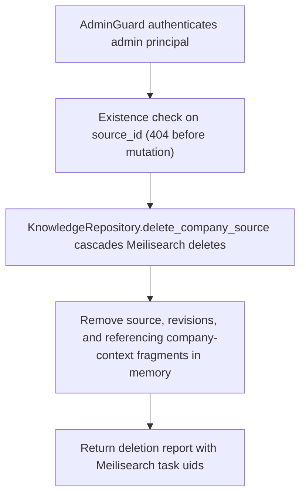

# DELETE /v1/state/company-docs/{source_id}

## Summary
Delete a company document source, its revisions, and every company-context fragment that references it. The Meilisearch cascade runs before any in-memory mutation so a rejected persistence call leaves state intact.

## Handler
- Rust handler: `delete_company_doc`
- Route registration: `src/routes.rs::build_router`
- Authentication: AdminGuard required

## Path Parameters
| Name | Type | Description |
| --- | --- | --- |
| source_id | string | Company document source identifier. |

## Query Parameters
None.

## JSON Body Parameters
No JSON body.

## Response
Schema: `JsonValue` (task fields mirror `DeleteSourceReport`)

| Field | Type | Description |
| --- | --- | --- |
| source_id | string | Deleted source identifier. |
| deleted | boolean | Always `true` on success. |
| fragments_task | string or null | Meilisearch task uid for the fragment deletion cascade; null on the memory backend. |
| revisions_task | string or null | Meilisearch task uid for the revision deletion cascade; null on the memory backend. |
| source_task | string or null | Meilisearch task uid for the source row deletion; null on the memory backend. |
| auxiliary_tasks | string[] | Meilisearch task uids for auxiliary tracking-row cleanup; empty on the memory backend. |

## Errors and Access Rules
- Missing or invalid bearer authentication returns 401.
- Authenticated non-admin principals, including `company_writer` and callers admitted by legacy shared-writer mode, return 403.
- Unknown `source_id` returns 404 (`source not found`) before any Meilisearch call.
- Authorization denials and store success/failure emit structured audit events with keyed identifiers correlated by the response `X-Request-Id`.
- Store, Meilisearch, or LLM failures are returned through the shared ApiError JSON envelope; a Meilisearch rejection leaves in-memory state unchanged.

## Internal Logic Call Graph

