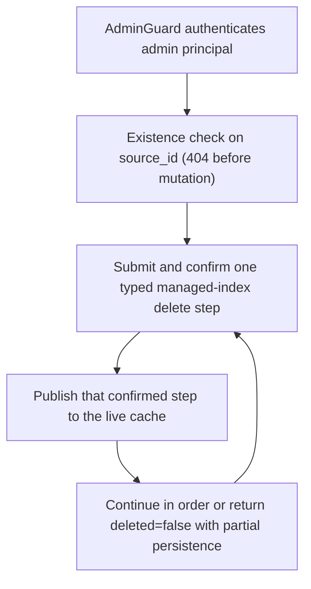

# DELETE /v1/state/company-docs/{source_id}

## Summary
Delete a company document source, its revisions, and every company-context fragment and related link that references it. Each confirmed Meilisearch step is projected into memory immediately; a later failure is reported as partial and leaves only the confirmed subset deleted.

## Handler
- Rust handler: `delete_company_doc`
- Route registration: `src/routes.rs::build_router`
- Authentication: AdminGuard required

## Path Parameters
| Name | Type | Description |
| --- | --- | --- |
| source_id | string | Company document source identifier. |

## Query Parameters
None.

## JSON Body Parameters
No JSON body.

## Response
Schema: `JsonValue` (task fields mirror `DeleteSourceReport`)

| Field | Type | Description |
| --- | --- | --- |
| source_id | string | Deleted source identifier. |
| deleted | boolean | `true` only when every ordered delete step is confirmed; `false` when persistence is partially failed. |
| fragments_task | string or null | Meilisearch task uid for the fragment deletion cascade; null on the memory backend. |
| revisions_task | string or null | Meilisearch task uid for the revision deletion cascade; null on the memory backend. |
| source_task | string or null | Meilisearch task uid for the source row deletion; null on the memory backend. |
| auxiliary_tasks | string[] | Ordered task uids for source documents, parse artifacts, parsed blocks, ingest tasks/results, links, and link-idempotency cleanup; empty on the memory backend. |
| persistence | PersistenceMetadata? | Additive durable operation metadata. `primary_task_uids` preserves the three legacy task positions followed by auxiliary cleanup tasks; `task_uids` includes every operation task. |

## Errors and Access Rules
- Missing or invalid bearer authentication returns 401.
- Authenticated non-admin principals, including `company_writer` and callers admitted by legacy shared-writer mode, return 403.
- Unknown `source_id` returns 404 (`source not found`) before any Meilisearch call.
- Authorization denials and store success/failure emit structured audit events with keyed identifiers correlated by the response `X-Request-Id`.
- A failure before the primary fragment step is confirmed returns the shared ApiError JSON envelope. A later-step failure returns `deleted=false` with partial persistence metadata; every earlier confirmed delete is already absent from live reads.
- Deletion returns 409 while an older source revision, company ingest, or related-link operation remains nonterminal; reconcile that predecessor first so it cannot resurrect deleted data.
- A repeated DELETE returns 409 while the prior deletion operation is nonterminal; reconcile the original operation instead of creating a second deletion plan.
- Recreating, activating, company-ingesting, or writing a related link for the same source closure is rejected with 409 while a partial delete remains reconcilable.
- Link cleanup loads read-through-only source documents by tenant/source before planning and deletes by both known link IDs and the captured source/target URI closure, so restart does not require a source-document cache warmup before deletion.
- `deleted=true` requires both every managed-index task and the journal checkpoint recording the final completion to be confirmed.

## Internal Logic Call Graph

