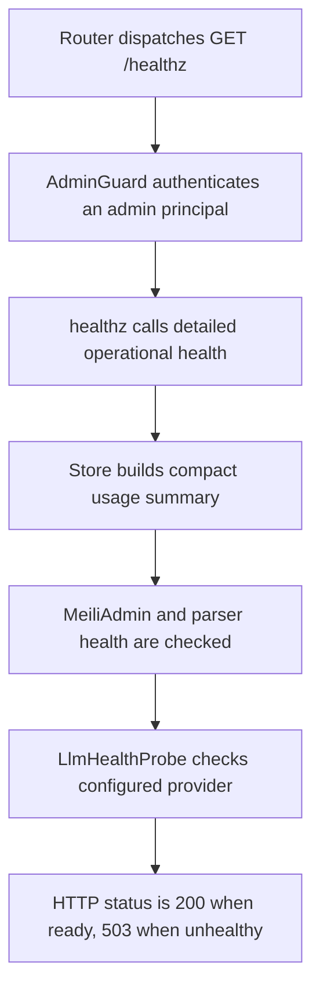

# GET /healthz

## Summary
Admin-only operational diagnostics for Meilisearch, parser, LLM health, store backend, and compact usage.

## Handler
- Rust handler: `healthz`
- Route registration: `src/routes.rs::build_router`
- Authentication: AdminGuard required

## Path Parameters
None.

## Query Parameters
None.

## JSON Body Parameters
No JSON body.

## Response
Schema: `HealthResponse`

| Field | Type | Description |
| --- | --- | --- |
| status | string | ok, degraded, or unhealthy. |
| ready | boolean | True when Meilisearch and required LLM checks allow traffic. |
| version | string | Crate version baked in at compile time. |
| git_rev | string | Short git revision of the build, `-dirty` suffix when built from a modified tree, `unknown` outside a git checkout. |
| store_backend | string | Active store backend name. |
| meilisearch | object | Meilisearch health payload. |
| parser | object | Parser health payload. |
| llm | object | LLM health payload with provider, model, auth, quota, rate-limit, and stale status. |
| usage | object | Compact usage summary. |

### `llm.rate_limits` Fields
The freshest live snapshot for the configured provider. Health probes and
real completions (RAG answer, analysis, title) both refresh it; `captured_at`
says when it was last observed. For `codex_auth` the windows come from the
`x-codex-*` response headers of the ChatGPT Codex backend.

| Field | Type | Description |
| --- | --- | --- |
| captured_at | string? | RFC3339 time the snapshot was observed on a live upstream response. |
| plan_type | string? | Codex subscription plan (`x-codex-plan-type`). |
| active_limit | string? | Limit bucket currently governing (`x-codex-active-limit`). |
| primary | object? | Short (5h) window: `used_percent`, `remaining_percent`, `window_minutes`, `resets_in_seconds`, `resets_at`. |
| secondary | object? | Long (weekly) window, same fields as `primary`. |
| credits | object? | `has_credits`, `unlimited`, `balance` from the Codex credits headers. |
| additional_limits | array? | Model-scoped buckets (`name`, `limit_name`, `primary`, `secondary`). |
| remaining_requests / remaining_tokens / reset_requests / reset_tokens | string? | OpenAI API-style `x-ratelimit-*` values when the provider is `openai_api_key`. |

`llm.rate_limit_state` is `ok`, `near_limit` (any window ≥ 90% used),
`limited` (any window ≥ 100% used or upstream 429), or `unknown`.
`remaining_percent` is the "left available usage" for dashboards.

## Errors and Access Rules
- Missing or invalid bearer authentication returns 401.
- Authenticated non-admin principals return 403.
- Returns 200 when ready and 503 when mandatory dependency health makes the service unready.
- This protected route may expose operational budgets and private aggregate counts to admins; public callers must use `/readyz`.

## Internal Logic Call Graph

