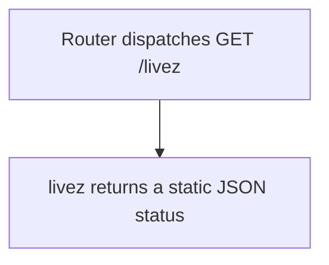

# GET /livez

## Summary
Process liveness probe. It returns ok when the HTTP process is reachable.

## Handler
- Rust handler: `livez`
- Route registration: `src/routes.rs::build_router`
- Authentication: None

## Path Parameters
None.

## Query Parameters
None.

## JSON Body Parameters
No JSON body.

## Response
Schema: `LivezResponse`

| Field | Type | Description |
| --- | --- | --- |
| status | string | Always ok when the process can serve the request. |
| version | string | Crate version baked in at compile time. |
| git_rev | string | Short git revision of the build, `-dirty` suffix when built from a modified tree, `unknown` outside a git checkout. |

## Errors and Access Rules
- Public; no bearer token is required.
- This endpoint performs no store, Meilisearch, parser, or LLM checks.
- It bypasses request-body buffering, rate limiting, global in-flight capacity,
  and route timeout enforcement so saturation does not hide a live process.
- Successful responses still include the server-generated `X-Request-Id` and
  configured CORS policy.
- A serving process returns 200. Connection-level failures occur before an HTTP response exists.

## Internal Logic Call Graph

