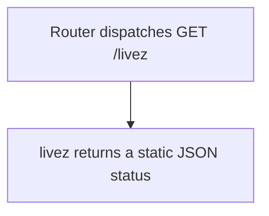

# GET /livez

## Summary
Process liveness probe. It returns ok when the HTTP process is reachable.

## Handler
- Rust handler: `livez`
- Route registration: `src/routes.rs::build_router`
- Authentication: None

## Path Parameters
None.

## Query Parameters
None.

## JSON Body Parameters
No JSON body.

## Response
Schema: `LivezResponse`

| Field | Type | Description |
| --- | --- | --- |
| status | string | Always ok when the process can serve the request. |

## Errors and Access Rules
- Malformed JSON or missing required runtime fields returns 400.
- Owner-scoped endpoints return 403 when the authenticated principal cannot access the requested owner.
- Store, Meilisearch, or LLM failures are returned through the shared ApiError JSON envelope.

## Internal Logic Call Graph

