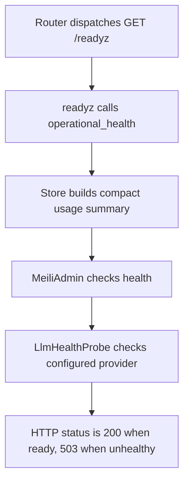

# GET /readyz

## Summary
Readiness probe with the same operational checks as /healthz.

## Handler
- Rust handler: `readyz`
- Route registration: `src/routes.rs::build_router`
- Authentication: None

## Path Parameters
None.

## Query Parameters
None.

## JSON Body Parameters
No JSON body.

## Response
Schema: `HealthResponse`

| Field | Type | Description |
| --- | --- | --- |
| status | string | ok, degraded, or unhealthy. |
| ready | boolean | True when Meilisearch and required LLM checks allow traffic. |
| version | string | Crate version baked in at compile time. |
| git_rev | string | Short git revision of the build, `-dirty` suffix when built from a modified tree, `unknown` outside a git checkout. |
| store_backend | string | Active store backend name. |
| meilisearch | object | Meilisearch health payload. |
| llm | object | LLM health payload with provider, model, auth, quota, and stale status. |
| usage | object | Compact usage summary. |

## Errors and Access Rules
- Malformed JSON or missing required runtime fields returns 400.
- Owner-scoped endpoints return 403 when the authenticated principal cannot access the requested owner.
- Store, Meilisearch, or LLM failures are returned through the shared ApiError JSON envelope.

## Internal Logic Call Graph

