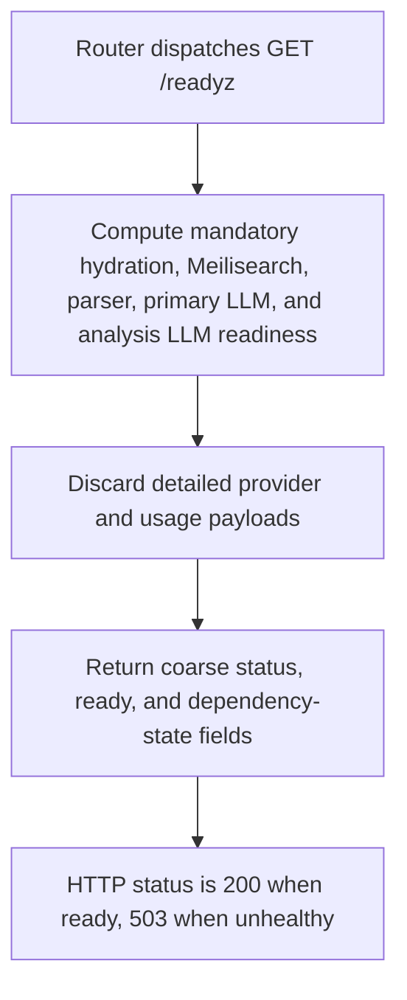

# GET /readyz

## Summary
Public coarse readiness probe for load balancers and deployment checks.

## Handler
- Rust handler: `readyz`
- Route registration: `src/routes.rs::build_router`
- Authentication: None

## Path Parameters
None.

## Query Parameters
None.

## JSON Body Parameters
No JSON body.

## Response
Schema: JSON readiness summary

| Field | Type | Description |
| --- | --- | --- |
| status | string | ok, degraded, or unhealthy. |
| ready | boolean | True when mandatory hydration completed and Meilisearch, parser, and required LLM checks allow traffic. |
| version | string | Crate version baked in at compile time. |
| git_rev | string | Revision asserted through `NOWLEDGE_GIT_REVISION` against a clean Git `HEAD` when metadata is available; otherwise the short checkout revision, with `-dirty` for modified tracked files or `unknown` outside a checkout. |
| dependencies | object | Coarse state for Meilisearch, hydration, parser, primary `llm`, and `analysis_llm` dependencies. Hydration is `pending`, `complete`, `incomplete`, or `not_required`. |

The readiness decision still checks configured mandatory dependencies, but the
public response intentionally omits store-backend details, raw dependency
payloads, provider/model names, credential sources, usage and private object
counts, plan data, rate-limit budgets, and credits.

## Errors and Access Rules
- Public; no bearer token is required.
- Returns 200 when ready and 503 when hydration is incomplete/pending or any mandatory dependency makes the service unready.
- Dependency failures are represented only by the coarse status and ready fields; use authenticated `/healthz` for details.
- The public readiness-probe rate bucket can return 429
  `too_many_requests`; global in-flight pressure can return 503
  `service_unavailable`. Both boundary responses use the shared error envelope
  and include `Retry-After`, unlike an ordinary dependency-health 503.
- `RAG_REQUEST_TIMEOUT_MS` can return 504 `timeout`. Every response includes
  `X-Request-Id`.

## Internal Logic Call Graph

