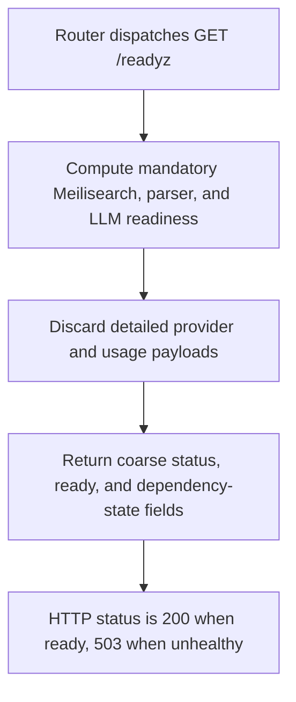

# GET /readyz

## Summary
Public coarse readiness probe for load balancers and deployment checks.

## Handler
- Rust handler: `readyz`
- Route registration: `src/routes.rs::build_router`
- Authentication: None

## Path Parameters
None.

## Query Parameters
None.

## JSON Body Parameters
No JSON body.

## Response
Schema: JSON readiness summary

| Field | Type | Description |
| --- | --- | --- |
| status | string | ok, degraded, or unhealthy. |
| ready | boolean | True when Meilisearch and required LLM checks allow traffic. |
| version | string | Crate version baked in at compile time. |
| git_rev | string | Short git revision of the build, `-dirty` suffix when built from a modified tree, `unknown` outside a git checkout. |
| dependencies | object | Coarse `ok`, `degraded`, or `unhealthy` state for Meilisearch, parser, and LLM dependencies. |

The readiness decision still checks configured mandatory dependencies, but the
public response intentionally omits store-backend details, raw dependency
payloads, provider/model names, credential sources, usage and private object
counts, plan data, rate-limit budgets, and credits.

## Errors and Access Rules
- Public; no bearer token is required.
- Returns 200 when ready and 503 when any mandatory dependency makes the service unready.
- Dependency failures are represented only by the coarse status and ready fields; use authenticated `/healthz` for details.

## Internal Logic Call Graph

