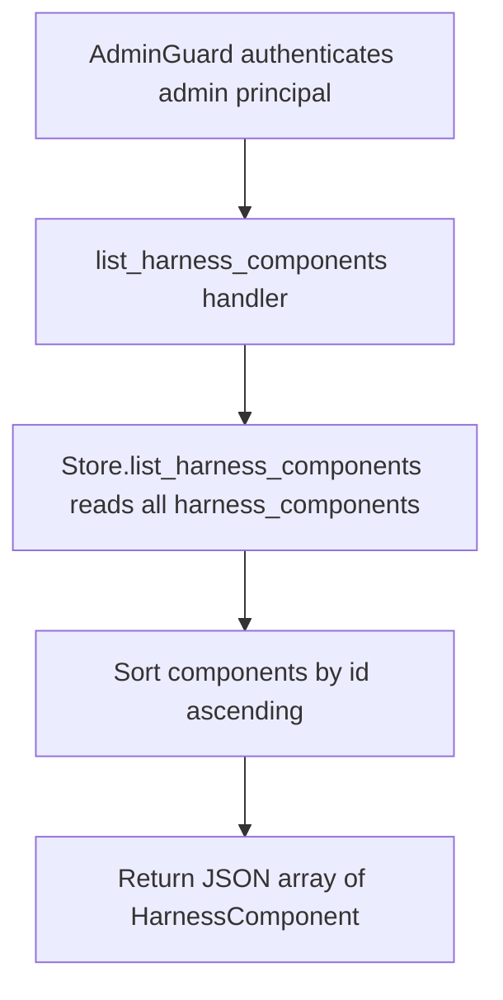

# GET /v1/admin/harness/components

## Summary
List every harness component for the tenant. Components are returned as a flat JSON array sorted by `id` ascending. An empty catalog returns `[]` rather than a 404.

## Handler
- Rust handler: `list_harness_components`
- Route registration: `src/routes.rs::build_router`
- Authentication: AdminGuard

## Path Parameters
None.

## Query Parameters
None.

## JSON Body Parameters
No JSON body.

## Response
Schema: `Vec<HarnessComponent>` (top-level JSON array; each element is a `HarnessComponent`)

| Field | Type | Description |
| --- | --- | --- |
| id | string | Component identifier. |
| tenant_id | string | Owning tenant id. |
| display_name | string | Human-readable component name. |
| component_kind | string | Component category/kind label. |
| description | string | Free-text description. |
| status | string | Lifecycle status (for example `active`). |
| current_revision_id | string or null | Active revision id; the field is omitted when the component has no revision yet. |
| created_at | string (RFC3339) | Creation timestamp. |
| updated_at | string (RFC3339) | Last update timestamp. |

## Errors and Access Rules
- Malformed JSON or missing required runtime fields returns 400.
- Owner-scoped endpoints return 403 when the authenticated principal cannot access the requested owner.
- Store, Meilisearch, or LLM failures are returned through the shared ApiError JSON envelope.
- Admin-only: requires a valid admin principal via `AdminGuard`; non-admin principals return 403 (`admin token required`) and missing or invalid bearer tokens return 401.

## Internal Logic Call Graph

