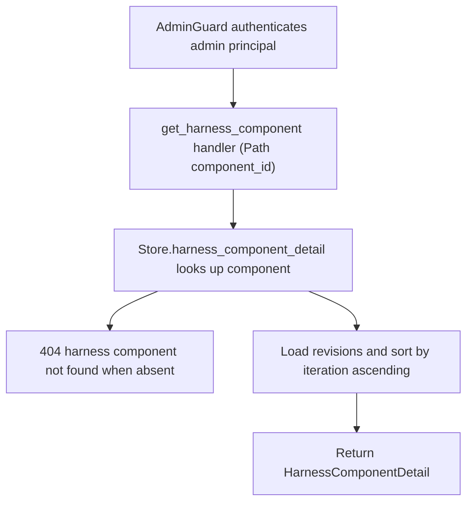

# GET /v1/admin/harness/components/{component_id}

## Summary
Return one harness component together with its full revision history. Revisions are sorted by `iteration` ascending. An unknown component id returns 404 before anything else runs.

## Handler
- Rust handler: `get_harness_component`
- Route registration: `src/routes.rs::build_router`
- Authentication: AdminGuard

## Path Parameters
| Name | Type | Description |
| --- | --- | --- |
| component_id | string | Harness component identifier to fetch. |

## Query Parameters
None.

## JSON Body Parameters
No JSON body.

## Response
Schema: `HarnessComponentDetail`

| Field | Type | Description |
| --- | --- | --- |
| component | HarnessComponent | The component record (fields below). |
| revisions | HarnessComponentRevision[] | All revisions for the component, sorted by `iteration` ascending (empty array when none exist). |

`HarnessComponent` fields:

| Field | Type | Description |
| --- | --- | --- |
| id | string | Component identifier. |
| tenant_id | string | Owning tenant id. |
| display_name | string | Human-readable component name. |
| component_kind | string | Component category/kind label. |
| description | string | Free-text description. |
| status | string | Lifecycle status (for example `active`). |
| current_revision_id | string or null | Active revision id; omitted when the component has no revision yet. |
| created_at | string (RFC3339) | Creation timestamp. |
| updated_at | string (RFC3339) | Last update timestamp. |

`HarnessComponentRevision` fields:

| Field | Type | Description |
| --- | --- | --- |
| id | string | Revision identifier (`hrev` prefix). |
| tenant_id | string | Owning tenant id. |
| component_id | string | Parent component id. |
| iteration | integer (u32) | Monotonic revision number, starting at 1. |
| manifest_id | string | Harness change manifest that produced this revision. |
| files | string[] | Files carried by the revision. |
| content | any (JSON) | Arbitrary revision payload; defaults to `null`. |
| status | string | Revision status: `active`, `superseded`, or `rolled_back`. |
| created_by | string | Author; defaults to `admin`. |
| created_at | string (RFC3339) | Creation timestamp. |

## Errors and Access Rules
- Malformed JSON or missing required runtime fields returns 400.
- Owner-scoped endpoints return 403 when the authenticated principal cannot access the requested owner.
- Store, Meilisearch, or LLM failures are returned through the shared ApiError JSON envelope.
- Unknown `component_id` returns 404 (`harness component not found`).
- Admin-only: requires a valid admin principal via `AdminGuard`; non-admin principals return 403 (`admin token required`) and missing or invalid bearer tokens return 401.

## Internal Logic Call Graph

