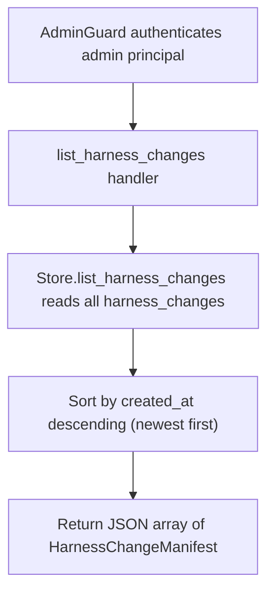

# GET /v1/admin/harness/evolution/changes

## Summary
List every harness change manifest for the tenant, sorted by `created_at` descending (newest first). An empty set returns `[]`.

## Handler
- Rust handler: `list_harness_changes`
- Route registration: `src/routes.rs::build_router`
- Authentication: AdminGuard

## Path Parameters
None.

## Query Parameters
None.

## JSON Body Parameters
No JSON body.

## Response
Schema: `Vec<HarnessChangeManifest>` (top-level JSON array; each element is a `HarnessChangeManifest`)

| Field | Type | Description |
| --- | --- | --- |
| id | string | Change identifier (`hchange` prefix). |
| tenant_id | string | Owning tenant id. |
| iteration | integer (u32) | Iteration number. |
| type | string | Change type: `new`, `improvement`, or `rollback` (serialized field name is `type`). |
| component_id | string | Target component id. |
| files | string[] | Files touched by the change. |
| failure_pattern | string | Observed failure pattern being addressed. |
| root_cause | string | Diagnosed root cause. |
| targeted_fix | string | Description of the targeted fix. |
| predicted_fixes | string[] | Case ids / fixes expected to pass after the change. |
| risk_cases | string[] | Case ids at risk of regression. |
| expected_metric_deltas | any (JSON) | Expected metric movement; `null` when unset. |
| baseline_eval_run_id | string or null | Baseline eval run id; omitted when unset. |
| candidate_eval_run_id | string or null | Candidate eval run id; omitted when unset. |
| why_this_component | string | Rationale for targeting this component. |
| created_by | string | Author. |
| created_at | string (RFC3339) | Creation timestamp (sort key, descending). |
| status | string | Lifecycle status: `proposed`, `applied`, `rollback`, or a verdict value. |

## Errors and Access Rules
- Malformed JSON or missing required runtime fields returns 400.
- Owner-scoped endpoints return 403 when the authenticated principal cannot access the requested owner.
- Store, Meilisearch, or LLM failures are returned through the shared ApiError JSON envelope.
- Admin-only: requires a valid admin principal via `AdminGuard`; non-admin principals return 403 (`admin token required`) and missing or invalid bearer tokens return 401.

## Internal Logic Call Graph

