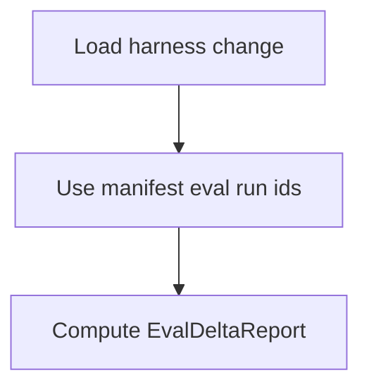

# GET /v1/admin/harness/evolution/changes/{change_id}/delta

Return the stored-manifest before/after eval delta for a harness change.

## Handler

- Rust handler: `get_harness_change_delta`
- Route registration: `src/routes.rs::build_router`
- Authentication: AdminGuard required

## Response

`EvalDeltaReport`.

## Rules

- Admin-only.
- Requires `baseline_eval_run_id` and `candidate_eval_run_id` on the change manifest, or a discoverable latest candidate run for the change.

