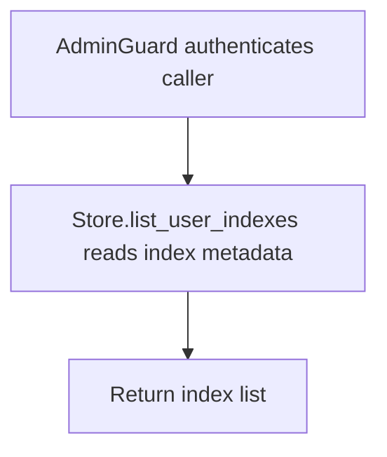

# GET /v1/admin/history/user-event-indexes

## Summary
List all known owner event index records.

## Handler
- Rust handler: `list_user_event_indexes`
- Route registration: `src/routes.rs::build_router`
- Authentication: AdminGuard

## Path Parameters
None.

## Query Parameters
None.

## JSON Body Parameters
No JSON body.

## Response
Schema: `ListUserEventIndexesResponse`

| Field | Type | Description |
| --- | --- | --- |
| indexes | UserEventIndex[] | Known user event indexes. |
| next_cursor | string? | Pagination cursor when present. |

## Errors and Access Rules
- Malformed JSON or missing required runtime fields returns 400.
- Owner-scoped endpoints return 403 when the authenticated principal cannot access the requested owner.
- Store, Meilisearch, or LLM failures are returned through the shared ApiError JSON envelope.

## Internal Logic Call Graph

