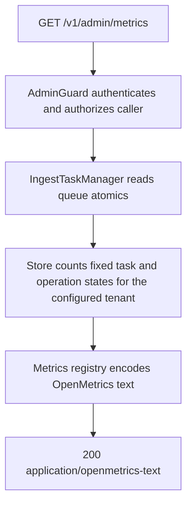

# GET /v1/admin/metrics

## Summary

Returns an OpenMetrics 1.0 snapshot for the current process and configured
tenant. The endpoint exposes bounded operational signals without probing an
upstream provider and without labels derived from tenants, owners, request
content, credentials, model names, document identifiers, or raw URLs.

## Handler

- Rust handler: `metrics`
- Route registration: `src/routes.rs::build_router`
- Authentication: AdminGuard required

## Path Parameters

None.

## Query Parameters

None.

## JSON Body Parameters

None.

## Response

Content type: `application/openmetrics-text; version=1.0.0; charset=utf-8`

The response is OpenMetrics text and ends with `# EOF`. It includes:

| Metric | Type | Description |
| --- | --- | --- |
| `nowledge_build_info` | info | Package version and an optional build-injected Git revision. |
| `nowledge_http_requests_total` | counter | Completed requests labeled only by bounded method, static route template or `unmatched`, and status class. |
| `nowledge_http_request_duration_seconds` | histogram | Time through response-body completion or cancellation, labeled only by bounded method and static route template. |
| `nowledge_http_request_bytes_total` | counter | Request-body bytes labeled only by bounded method and static route template. |
| `nowledge_http_response_bytes_total` | counter | Response-body bytes actually emitted before completion, error, or cancellation, with the same bounded HTTP labels. |
| `nowledge_http_in_flight` | gauge | Requests whose response bodies have not completed or been cancelled. |
| `nowledge_ingest_queue_depth` | gauge | Admitted ingest jobs not yet running. |
| `nowledge_ingest_accepting` | gauge | `1` while the ingest dispatcher accepts new work, otherwise `0`. |
| `nowledge_ingest_tasks` | gauge family | Current tenant task counts for the fixed ingest-state vocabulary. |
| `nowledge_ingest_stage_duration_seconds` | histogram | Parsing, fragmenting, and indexing stage duration by fixed outcome. |
| `nowledge_ingest_stage_failures_total` | counter | Failed or cancelled ingest stages by fixed stage. |
| `nowledge_meili_task_duration_seconds` | histogram | Time spent awaiting accepted Meilisearch writes by fixed operation and outcome. |
| `nowledge_meili_task_failures_total` | counter | Meilisearch task-wait failures by fixed operation and failure class. |
| `nowledge_rag_stage_duration_seconds` | histogram | Retrieval and generation duration by fixed stage and outcome. |
| `nowledge_rag_stage_candidates` | histogram | Candidate counts at fixed RAG stages. |
| `nowledge_llm_request_duration_seconds` | histogram | Terminal LLM request latency by `primary`/`analysis`, bounded provider, and outcome. |
| `nowledge_llm_tokens_total` | counter | Provider-reported input, cached-input, output, reasoning-output, and total tokens. |
| `nowledge_llm_retries_total` | counter | Actual upstream retries observed before a terminal response. |
| `nowledge_llm_timeouts_total` | counter | LLM requests ending in a timeout. |
| `nowledge_llm_rate_limit_state` | gauge | Latest state encoded as `unknown=0`, `ok=1`, `near_limit=2`, or `limited=3`. |
| `nowledge_cache_accesses_total` | counter | In-process cache hits, misses, and stores by a fixed resource vocabulary. |
| `nowledge_read_through_total` | counter | Repository read-through loads, misses, and failures by fixed resource. |
| `nowledge_hydration_records_total` | counter | Startup hydration loaded, quarantined, recovered, and failed counts by fixed domain. |
| `nowledge_operations` | gauge family | Current tenant mutation-journal counts for the fixed operation-status vocabulary. |
| `nowledge_audit_background_drops_total` | counter | Best-effort denial/finalization audit records dropped for one of the fixed `rate_limit`, `capacity`, `shutdown`, or `persistence` reasons. |

Set `NOWLEDGE_GIT_REVISION` to a 7-64 character hexadecimal commit ID while
building from that clean tracked Git `HEAD`; a mismatch or tracked change makes
the build fail. When Git metadata is unavailable, the supplied value remains
the immutable build label. `build.rs` normalizes either path into the canonical
compile-time `NOWLEDGE_GIT_REV` consumed by both health and build-info output.

## Errors and Access Rules

- Missing or invalid authentication returns 401.
- A valid non-admin principal returns 403.
- The endpoint never performs a Meilisearch, parser, or LLM health probe.
- A local snapshot or encoding failure returns the shared JSON error envelope.
- Metric labels never contain tenant IDs, owner IDs, request IDs, paths supplied
  by callers, query/body content, HMAC identifiers, provider data, or secrets.

## Internal Logic Call Graph

