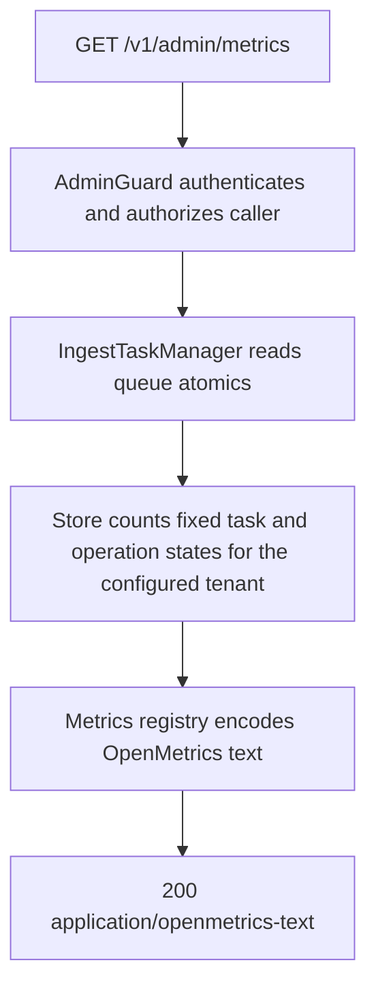

# GET /v1/admin/metrics

## Summary

Returns an OpenMetrics 1.0 snapshot for the current process and configured
tenant. The endpoint exposes bounded operational signals without probing an
upstream provider and without labels derived from tenants, owners, request
content, credentials, model names, document identifiers, or raw URLs.

## Handler

- Rust handler: `metrics`
- Route registration: `src/routes.rs::build_router`
- Authentication: AdminGuard required

## Path Parameters

None.

## Query Parameters

None.

## JSON Body Parameters

None.

## Response

Content type: `application/openmetrics-text; version=1.0.0; charset=utf-8`

The response is OpenMetrics text and ends with `# EOF`. It includes:

| Metric | Type | Description |
| --- | --- | --- |
| `nowledge_build_info` | info | Package version and an optional build-injected Git revision. |
| `nowledge_http_requests_total` | counter | Completed requests labeled only by bounded method, static route template or `unmatched`, and status class. |
| `nowledge_http_request_duration_seconds` | histogram | Time through response-body completion or cancellation, labeled only by bounded method and static route template. |
| `nowledge_http_in_flight` | gauge | Requests whose response bodies have not completed or been cancelled. |
| `nowledge_ingest_queue_depth` | gauge | Admitted ingest jobs not yet running. |
| `nowledge_ingest_accepting` | gauge | `1` while the ingest dispatcher accepts new work, otherwise `0`. |
| `nowledge_ingest_tasks` | gauge family | Current tenant task counts for the fixed ingest-state vocabulary. |
| `nowledge_operations` | gauge family | Current tenant mutation-journal counts for the fixed operation-status vocabulary. |

Set `NOWLEDGE_GIT_REVISION` to a 7-64 character hexadecimal commit ID while
compiling a release binary to populate the build revision; missing or malformed
values become `unknown`.

## Errors and Access Rules

- Missing or invalid authentication returns 401.
- A valid non-admin principal returns 403.
- The endpoint never performs a Meilisearch, parser, or LLM health probe.
- A local snapshot or encoding failure returns the shared JSON error envelope.
- Metric labels never contain tenant IDs, owner IDs, request IDs, paths supplied
  by callers, query/body content, HMAC identifiers, provider data, or secrets.

## Internal Logic Call Graph

