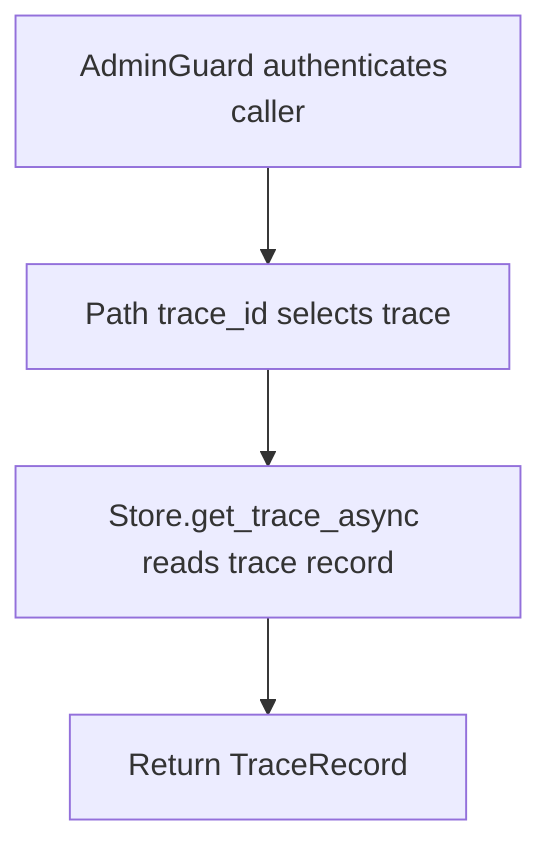

# GET /v1/debug/traces/{trace_id}

## Summary
Read a stored retrieval/debug trace by id.

## Handler
- Rust handler: `get_trace`
- Route registration: `src/routes.rs::build_router`
- Authentication: AdminGuard

## Path Parameters
| Name | Type | Description |
| --- | --- | --- |
| trace_id | string | Debug trace identifier. |

## Query Parameters
None.

## JSON Body Parameters
No JSON body.

## Response
Schema: `TraceRecord`

| Field | Type | Description |
| --- | --- | --- |
| ... | TraceRecord | Trace record including query, mode, stages, context URIs, owner, and timestamps. |

## Errors and Access Rules
- Malformed JSON or missing required runtime fields returns 400.
- Owner-scoped endpoints return 403 when the authenticated principal cannot access the requested owner.
- Store, Meilisearch, or LLM failures are returned through the shared ApiError JSON envelope.

## Internal Logic Call Graph

