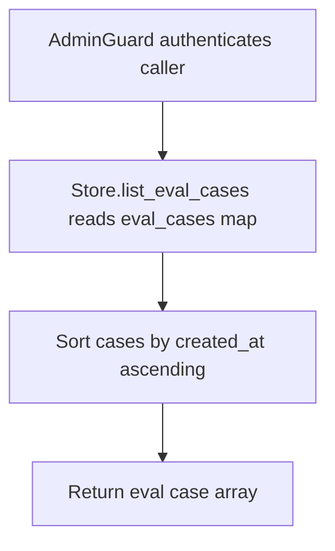

# GET /v1/eval/cases

## Summary
List every stored RAG evaluation case for the tenant, sorted by creation time ascending.

## Handler
- Rust handler: `list_eval_cases`
- Route registration: `src/routes.rs::build_router`
- Authentication: AdminGuard

## Path Parameters
None.

## Query Parameters
None.

## JSON Body Parameters
No JSON body.

## Response
Schema: `Vec<RagEvalCase>`

| Field | Type | Description |
| --- | --- | --- |
| (root) | object[] | Array of eval cases sorted by `created_at` ascending. |
| [].id | string | Eval case identifier (`evalcase` prefix when auto-minted). |
| [].tenant_id | string | Tenant that owns the case. |
| [].owner_user_id | string or null | Owner scope applied to retrieval during a run; omitted when unset. |
| [].question | string | Question replayed against context search when a run executes. |
| [].expected_context_uris | string[] | ContextFS URIs expected to appear in retrieval. |
| [].expected_source_document_uris | string[] | Source document URIs expected to appear in retrieval. |
| [].expected_answer_contains | string[] | Substrings expected in the generated answer. |
| [].tags | string[] | Free-form labels attached to the case. |
| [].metadata | object | Arbitrary caller-supplied metadata. |
| [].created_at | string | RFC3339 creation timestamp. |

## Errors and Access Rules
- Malformed JSON or missing required runtime fields returns 400.
- Owner-scoped endpoints return 403 when the authenticated principal cannot access the requested owner.
- Store, Meilisearch, or LLM failures are returned through the shared ApiError JSON envelope.
- Requires admin authentication; non-admin principals are rejected by AdminGuard.

## Internal Logic Call Graph

