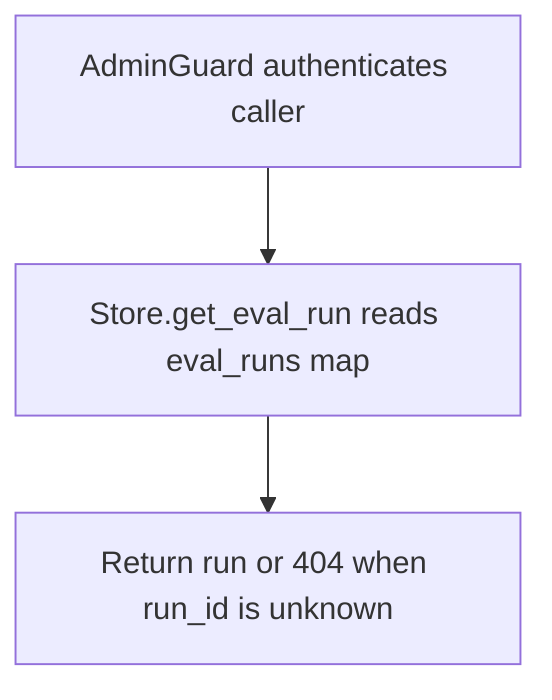

# GET /v1/eval/runs/{run_id}

## Summary
Fetch a single evaluation run record, including its aggregate metrics and regression guard outcomes.

## Handler
- Rust handler: `get_eval_run`
- Route registration: `src/routes.rs::build_router`
- Authentication: AdminGuard

## Path Parameters
| Name | Type | Description |
| --- | --- | --- |
| run_id | string | Evaluation run identifier. |

## Query Parameters
None.

## JSON Body Parameters
No JSON body.

## Response
Schema: `RagEvalRun`

| Field | Type | Description |
| --- | --- | --- |
| id | string | Run identifier (`evalrun` prefix). |
| tenant_id | string | Tenant that owns the run. |
| change_id | string or null | Associated change identifier; omitted when unset. |
| case_ids | string[] | Case identifiers included in the run. |
| result_ids | string[] | Identifiers of the per-case result records produced. |
| trace_ids | string[] | Retrieval trace identifiers, one per case. |
| status | string | `passed` when all cases and guards pass, otherwise `failed`. |
| metrics | object | Aggregate `RagEvalMetrics` for the run (see POST /v1/eval/runs for the full field list). |
| guard_results | object[] | Regression guard outcomes (`RegressionGuardResult`). |
| guard_results[].name | string | Guard identifier. |
| guard_results[].passed | boolean | Whether the guard passed. |
| guard_results[].evidence | object | Guard-specific evidence payload. |
| overview_source_document_uri | string or null | ContextFS URI of the persisted overview document; omitted when unset. |
| report_source_document_uris | string[] | ContextFS URIs of persisted per-case report documents. |
| created_by | string | Attribution recorded on the run. |
| created_at | string | RFC3339 creation timestamp. |
| completed_at | string or null | RFC3339 completion timestamp; omitted when unset. |

## Errors and Access Rules
- Malformed JSON or missing required runtime fields returns 400.
- Owner-scoped endpoints return 403 when the authenticated principal cannot access the requested owner.
- Store, Meilisearch, or LLM failures are returned through the shared ApiError JSON envelope.
- Requires admin authentication; non-admin principals are rejected by AdminGuard.
- An unknown `run_id` returns 404 (`eval run not found`).

## Internal Logic Call Graph

