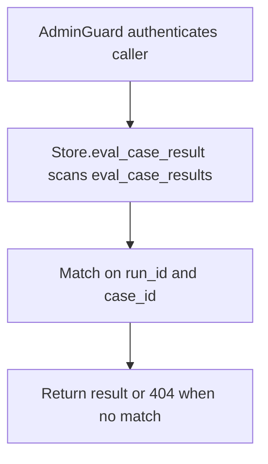

# GET /v1/eval/runs/{run_id}/analysis/cases/{case_id}

## Summary
Return the per-case evaluation result for a single case within a run, including its answer, citations, retrieved provenance, and failure/guard diagnostics.

## Handler
- Rust handler: `get_eval_case_analysis`
- Route registration: `src/routes.rs::build_router`
- Authentication: AdminGuard

## Path Parameters
| Name | Type | Description |
| --- | --- | --- |
| run_id | string | Evaluation run identifier. |
| case_id | string | Eval case identifier within the run. |

## Query Parameters
None.

## JSON Body Parameters
No JSON body.

## Response
Schema: `RagEvalCaseResult`

| Field | Type | Description |
| --- | --- | --- |
| id | string | Result record identifier. |
| run_id | string | Run the result belongs to. |
| case_id | string | Case the result evaluates. |
| owner_user_id | string or null | Owner scope applied during retrieval; omitted when unset. |
| status | string | Per-case outcome (`passed` or `failed`). |
| question | string | Question replayed for the case. |
| trace_id | string | Retrieval trace identifier for the case. |
| answer | string | Generated answer text. |
| citations | object[] | Answer citations with provenance (`Citation`). |
| retrieved_uris | string[] | ContextFS URIs retrieved for the case. |
| source_document_uris | string[] | Source document URIs referenced by retrieval. |
| failures | string[] | Assertion failures recorded for the case. |
| guard_failures | string[] | Regression guard failures attributed to the case. |
| metrics | object | Per-case metric payload. |
| latency_ms | integer | Case retrieval latency in milliseconds. |
| created_at | string | RFC3339 timestamp when the result was recorded. |

## Errors and Access Rules
- Malformed JSON or missing required runtime fields returns 400.
- Owner-scoped endpoints return 403 when the authenticated principal cannot access the requested owner.
- Store, Meilisearch, or LLM failures are returned through the shared ApiError JSON envelope.
- Requires admin authentication; non-admin principals are rejected by AdminGuard.
- No result matching both `run_id` and `case_id` returns 404 (`eval case result not found`).

## Internal Logic Call Graph

