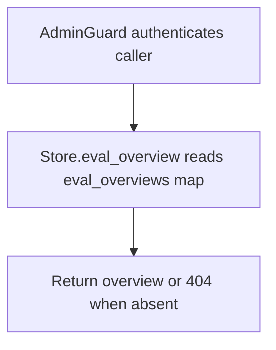

# GET /v1/eval/runs/{run_id}/analysis/overview

## Summary
Return the analysis overview for an evaluation run: aggregate metrics, clustered failure patterns, a suggested target component, root-cause notes, and a rendered markdown summary.

## Handler
- Rust handler: `get_eval_overview`
- Route registration: `src/routes.rs::build_router`
- Authentication: AdminGuard

## Path Parameters
| Name | Type | Description |
| --- | --- | --- |
| run_id | string | Evaluation run identifier. |

## Query Parameters
None.

## JSON Body Parameters
No JSON body.

## Response
Schema: `RagEvalOverview`

| Field | Type | Description |
| --- | --- | --- |
| run_id | string | Run the overview summarizes. |
| status | string | Run status (`passed` or `failed`). |
| metrics | object | Aggregate `RagEvalMetrics` (see POST /v1/eval/runs for the full field list). |
| failure_patterns | object[] | Clustered failure patterns (`FailurePatternCluster`). |
| failure_patterns[].pattern | string | Failure pattern label. |
| failure_patterns[].count | integer | Number of cases exhibiting the pattern. |
| failure_patterns[].case_ids | string[] | Case identifiers in the cluster. |
| failure_patterns[].suggested_target_component | string | Component the cluster points to. |
| failure_patterns[].root_cause_notes | string[] | Notes explaining the cluster. |
| suggested_target_component | string | Overall component most implicated by failures. |
| root_cause_notes | string[] | Overall root-cause notes across clusters. |
| overview_markdown | string | Rendered markdown summary of the run. |
| case_report_uris | string[] | ContextFS URIs of per-case report documents. |
| overview_source_document_uri | string or null | ContextFS URI of the persisted overview document; omitted when unset. |
| generated_at | string | RFC3339 timestamp when the overview was generated. |

## Errors and Access Rules
- Malformed JSON or missing required runtime fields returns 400.
- Owner-scoped endpoints return 403 when the authenticated principal cannot access the requested owner.
- Store, Meilisearch, or LLM failures are returned through the shared ApiError JSON envelope.
- Requires admin authentication; non-admin principals are rejected by AdminGuard.
- A run without a persisted overview (unknown `run_id` or no overview recorded) returns 404 (`eval overview not found`).

## Internal Logic Call Graph

