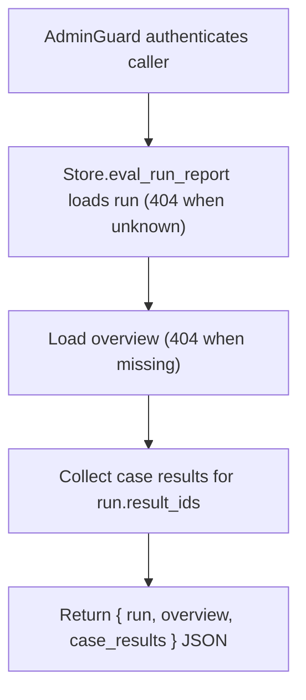

# GET /v1/eval/runs/{run_id}/report

## Summary
Return the full evaluation report for a run: the run record, its analysis overview, and every per-case result assembled into one payload.

## Handler
- Rust handler: `get_eval_run_report`
- Route registration: `src/routes.rs::build_router`
- Authentication: AdminGuard

## Path Parameters
| Name | Type | Description |
| --- | --- | --- |
| run_id | string | Evaluation run identifier. |

## Query Parameters
None.

## JSON Body Parameters
No JSON body.

## Response
Schema: `JsonValue`

| Field | Type | Description |
| --- | --- | --- |
| run | object | Full `RagEvalRun` record (see GET /v1/eval/runs/{run_id}). |
| overview | object | Full `RagEvalOverview` record (see GET /v1/eval/runs/{run_id}/analysis/overview). |
| case_results | object[] | `RagEvalCaseResult` records for the run's `result_ids`, in stored order (see GET /v1/eval/runs/{run_id}/analysis/cases/{case_id}). |

## Errors and Access Rules
- Malformed JSON or missing required runtime fields returns 400.
- Owner-scoped endpoints return 403 when the authenticated principal cannot access the requested owner.
- Store, Meilisearch, or LLM failures are returned through the shared ApiError JSON envelope.
- Requires admin authentication; non-admin principals are rejected by AdminGuard.
- An unknown `run_id` returns 404 (`eval run not found`).
- A run without a persisted overview returns 404 (`eval overview not found`).

## Internal Logic Call Graph

