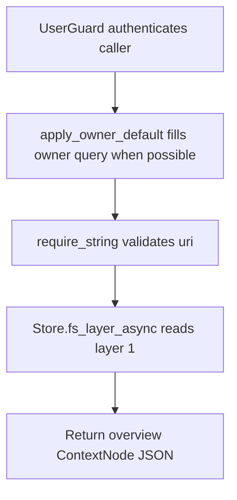

# GET /v1/fs/overview

## Summary
Read layer 1 overview content for a context URI.

## Handler
- Rust handler: `fs_overview`
- Route registration: `src/routes.rs::build_router`
- Authentication: UserGuard; owner default may apply

## Path Parameters
None.

## Query Parameters
| Name | Type | Requirement | Description |
| --- | --- | --- | --- |
| uri | string | required | Context URI whose overview layer should be read. |
| depth | integer | optional | Tree traversal depth for /v1/fs/tree. |
| owner_user_id | string | optional | Owner scope. Owner-bound auth can supply a default. |

## JSON Body Parameters
No JSON body.

## Response
Schema: `ContextNode`

| Field | Type | Description |
| --- | --- | --- |
| uri | string | Overview context URI. |
| title | string | Node title. |
| layer | integer | Always 1 for this endpoint. |
| body | string | Overview content. |
| node_kind | string | `overview`. |
| retrieval_role | string | Usually `overview`. |
| retrieval_enabled | boolean | Whether this node participates in default retrieval. |
| source_document_uri | string? | Full source document URI when the overview belongs to a source-backed context item. |
| status | string | Node status. |

## Errors and Access Rules
- Malformed JSON or missing required runtime fields returns 400.
- Owner-scoped endpoints return 403 when the authenticated principal cannot access the requested owner.
- Store, Meilisearch, or LLM failures are returned through the shared ApiError JSON envelope.
- uri query parameter is required.

## Internal Logic Call Graph

