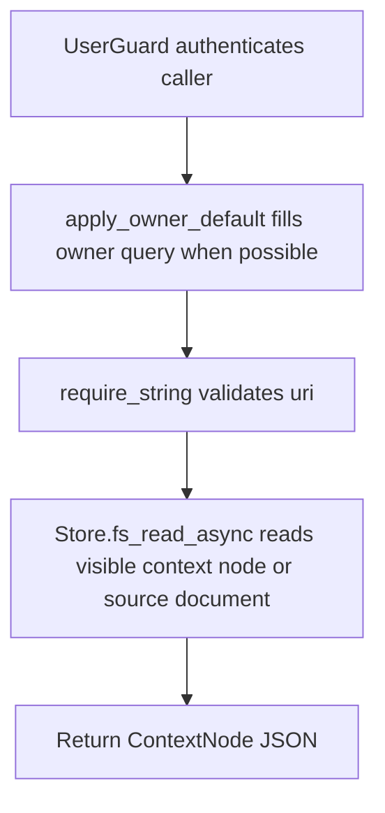

# GET /v1/fs/read

## Summary
Read a concrete context node by URI. This endpoint can also explicitly read an active source document URI with normal ACL checks.

## Handler
- Rust handler: `fs_read`
- Route registration: `src/routes.rs::build_router`
- Authentication: UserGuard; owner default may apply

## Path Parameters
None.

## Query Parameters
| Name | Type | Requirement | Description |
| --- | --- | --- | --- |
| uri | string | required | Context or source document URI to read. |
| depth | integer | optional | Tree traversal depth for /v1/fs/tree. |
| owner_user_id | string | optional | Owner scope. Owner-bound auth can supply a default. |

## JSON Body Parameters
No JSON body.

## Response
Schema: `ContextNode`

| Field | Type | Description |
| --- | --- | --- |
| uri | string | Context or source document URI. |
| title | string | Node title. |
| layer | integer | Context layer; source documents are returned as layer 2 nodes. |
| body | string | Node body. For source document reads, this is the full original document content. |
| tenant_id | string | Tenant id. |
| owner_user_id | string? | Owner scope for personal nodes/documents. |
| index_uid | string | Backing index UID, such as `rag_source_documents` for source docs. |
| index_kind | string | Context scope, such as `company` or `personal`. |
| ancestor_uris | string[] | URI ancestors. |
| node_kind | string | `source_doc`, `fragment`, `abstract`, or `overview`. |
| retrieval_role | string | `none`, `fragment`, or `overview`. |
| retrieval_enabled | boolean | Whether the node participates in default retrieval. Source docs return false. |
| parent_uri | string? | Parent context URI when present. |
| source_document_uri | string? | Full source document URI when present. |
| fragment_index | integer? | Fragment index for fragment nodes. |
| char_start | integer? | Fragment start character offset in the source document. |
| char_end | integer? | Fragment end character offset in the source document. |
| token_estimate | integer? | Approximate token count. |
| checksum | string? | Stable checksum. |
| source_id | string? | Source identifier when present. |
| revision_id | string? | Source revision identifier when present. |
| status | string | Node/document status. |
| privacy | string | Privacy scope. |
| updated_at | RFC3339 datetime | Last update time. |

## Errors and Access Rules
- Malformed JSON or missing required runtime fields returns 400.
- Owner-scoped endpoints return 403 when the authenticated principal cannot access the requested owner.
- Store, Meilisearch, or LLM failures are returned through the shared ApiError JSON envelope.
- uri query parameter is required.
- Only active nodes/source documents visible to the caller are returned.

## Internal Logic Call Graph

