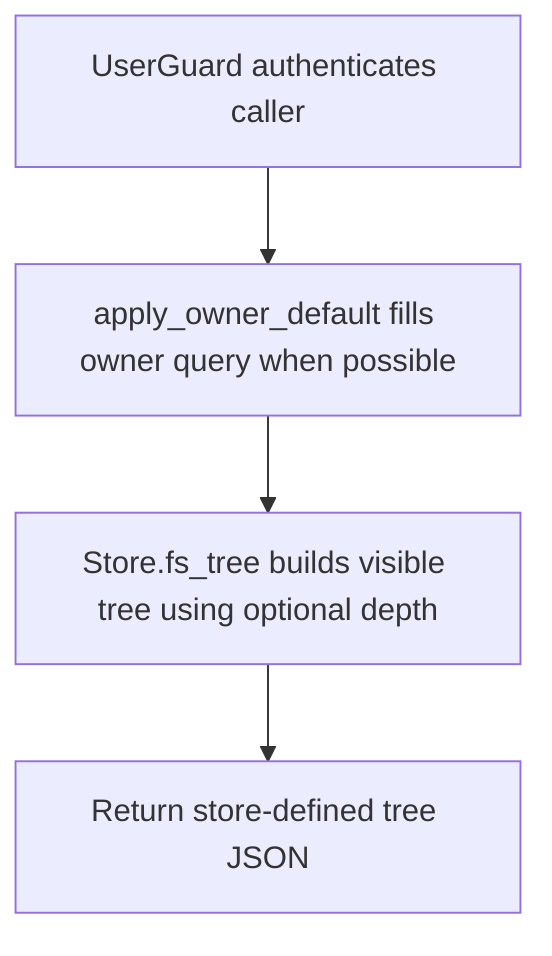

# GET /v1/fs/tree

## Summary
Return a visible context filesystem tree.

## Handler
- Rust handler: `fs_tree`
- Route registration: `src/routes.rs::build_router`
- Authentication: UserGuard; owner default may apply

## Path Parameters
None.

## Query Parameters
| Name | Type | Requirement | Description |
| --- | --- | --- | --- |
| uri | string | optional except read/abstract/overview | Context URI to list from or read. |
| depth | integer | optional | Tree traversal depth for /v1/fs/tree. |
| owner_user_id | string | optional | Owner scope. Owner-bound auth can supply a default. |

## JSON Body Parameters
No JSON body.

## Response
Schema: `JsonValue`

| Field | Type | Description |
| --- | --- | --- |
| uri | string | Tree root URI prefix. |
| depth | integer | Requested or default traversal depth. |
| children | object[] | Visible child context entries. |

### Child Entry Fields
| Field | Type | Description |
| --- | --- | --- |
| uri | string | Child context URI. |
| title | string | Child title. |
| layer | integer | Context layer. |
| index_kind | string | Context scope, such as `company` or `personal`. |

## Errors and Access Rules
- Malformed JSON or missing required runtime fields returns 400.
- Owner-scoped endpoints return 403 when the authenticated principal cannot access the requested owner.
- Store, Meilisearch, or LLM failures are returned through the shared ApiError JSON envelope.

## Internal Logic Call Graph

