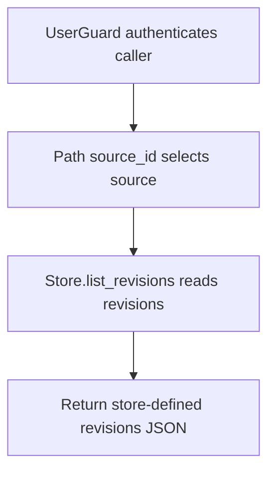

# GET /v1/history/company-docs/{source_id}/revisions

## Summary
List revisions for a company document source.

## Handler
- Rust handler: `list_revisions`
- Route registration: `src/routes.rs::build_router`
- Authentication: UserGuard

## Path Parameters
| Name | Type | Description |
| --- | --- | --- |
| source_id | string | Company document source identifier. |

## Query Parameters
None.

## JSON Body Parameters
No JSON body.

## Response
Schema: `JsonValue`

| Field | Type | Description |
| --- | --- | --- |
| ... | object or array | Endpoint-specific JSON returned by the store or debug helper. |

## Errors and Access Rules
- Missing or invalid bearer authentication returns 401.
- Company-document revision history is tenant-shared: authenticated owner, tenant-service, company-writer, and admin principals may read it.
- Store, Meilisearch, or LLM failures are returned through the shared ApiError JSON envelope.

## Internal Logic Call Graph

