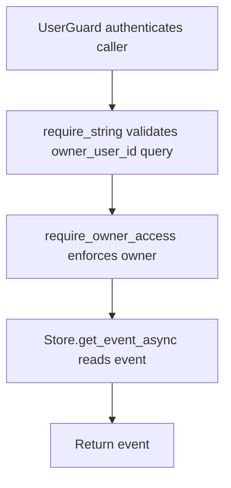

# GET /v1/history/events/{event_id}

## Summary
Owner-aware alias for reading one history event without owner in the path.

## Handler
- Rust handler: `get_event_alias`
- Route registration: `src/routes.rs::build_router`
- Authentication: UserGuard; owner_user_id query required

## Path Parameters
| Name | Type | Description |
| --- | --- | --- |
| event_id | string | History event identifier. |

## Query Parameters
| Name | Type | Requirement | Description |
| --- | --- | --- | --- |
| owner_user_id | string | optional | Owner scope. Owner-bound auth can supply a default; some alias reads require it explicitly. |

## JSON Body Parameters
No JSON body.

## Response
Schema: `HistoryEvent`

| Field | Type | Description |
| --- | --- | --- |
| ... | HistoryEvent | Full event record including owner, text, payload, routing, privacy, and timestamps. |

## Errors and Access Rules
- Malformed JSON or missing required runtime fields returns 400.
- Owner-scoped endpoints return 403 when the authenticated principal cannot access the requested owner.
- Store, Meilisearch, or LLM failures are returned through the shared ApiError JSON envelope.
- owner_user_id query parameter is required.

## Internal Logic Call Graph

