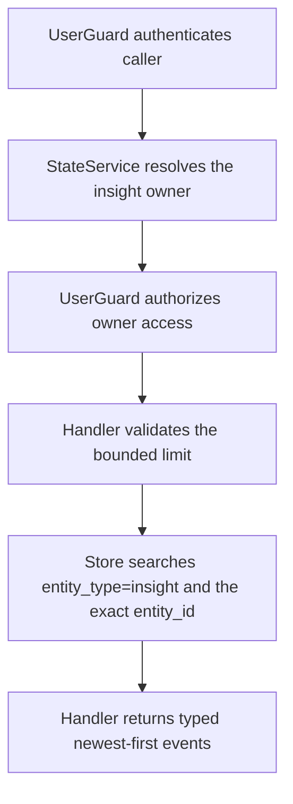

# GET /v1/history/insights/{insight_id}/events

## Summary
Return the bounded audit history associated with one insight, newest event first.

## Handler
- Rust handler: `insight_events`
- Route registration: `src/routes.rs::build_router`
- Authentication: UserGuard

## Path Parameters
| Name | Type | Description |
| --- | --- | --- |
| insight_id | string | Insight identifier. |

## Query Parameters
| Name | Type | Required | Default | Description |
| --- | --- | --- | --- | --- |
| limit | integer | No | 10 | Maximum events to return. Must not exceed `RAG_MAX_SEARCH_LIMIT`; zero follows the shared search convention and returns at least one event when available. |

## JSON Body Parameters
No JSON body.

## Response
Schema: `InsightEventsResponse` in `src/models_insights_links_analysis.rs`

| Field | Type | Description |
| --- | --- | --- |
| insight_id | string | The requested insight identifier. |
| events | `HistoryEvent[]` | Exact insight audit events ordered newest first. |

## Errors and Access Rules
- Unknown insight identifiers return 404 before history is searched.
- Owner-scoped callers receive 403 when the insight belongs to another owner.
- Tenant-service and admin callers may use the path insight as the explicit owner scope.
- A `limit` greater than `RAG_MAX_SEARCH_LIMIT` returns 400.
- Store or Meilisearch failures are returned through the shared `ApiError` JSON envelope.

## Internal Logic Call Graph

## Internal Logic Notes
- Insight upserts and patches already append immutable `HistoryEvent` records; this endpoint reads those records through the shared Store search path.
- Owner resolution happens before limit validation so an unauthorized caller cannot probe the existence or configuration of another owner's history.
