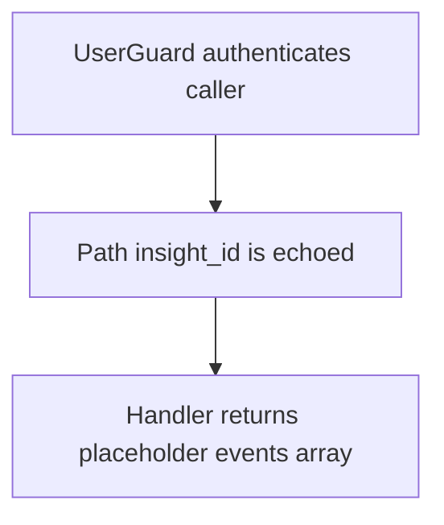

# GET /v1/history/insights/{insight_id}/events

## Summary
Return history events associated with an insight. The current handler returns an empty event list placeholder.

## Handler
- Rust handler: `insight_events`
- Route registration: `src/routes.rs::build_router`
- Authentication: UserGuard

## Path Parameters
| Name | Type | Description |
| --- | --- | --- |
| insight_id | string | Insight identifier. |

## Query Parameters
None.

## JSON Body Parameters
No JSON body.

## Response
Schema: `JsonValue`

| Field | Type | Description |
| --- | --- | --- |
| ... | object or array | Endpoint-specific JSON returned by the store or debug helper. |

## Errors and Access Rules
- Malformed JSON or missing required runtime fields returns 400.
- Owner-scoped endpoints return 403 when the authenticated principal cannot access the requested owner.
- Store, Meilisearch, or LLM failures are returned through the shared ApiError JSON envelope.

## Internal Logic Call Graph

## Internal Logic Notes
- Current implementation returns { insight_id, events: [] } and does not query Store.
