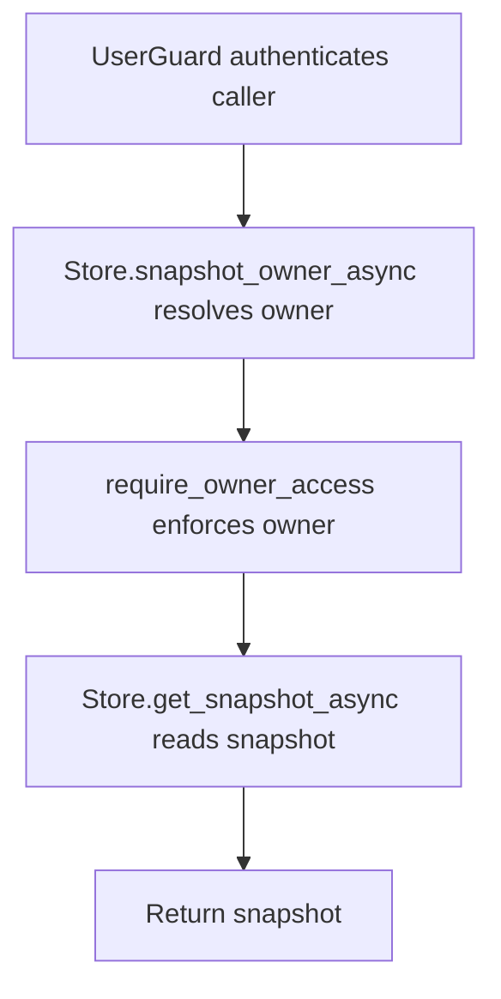

# GET /v1/history/structured/snapshots/{snapshot_id}

## Summary
Read structured snapshot metadata after checking the snapshot owner.

## Handler
- Rust handler: `get_snapshot`
- Route registration: `src/routes.rs::build_router`
- Authentication: UserGuard; snapshot owner enforced

## Path Parameters
| Name | Type | Description |
| --- | --- | --- |
| snapshot_id | string | Structured snapshot identifier. |

## Query Parameters
None.

## JSON Body Parameters
No JSON body.

## Response
Schema: `StructuredSnapshot`

| Field | Type | Description |
| --- | --- | --- |
| ... | StructuredSnapshot | Snapshot metadata including dataset, owner, period, row count, and status. |

## Errors and Access Rules
- Malformed JSON or missing required runtime fields returns 400.
- Owner-scoped endpoints return 403 when the authenticated principal cannot access the requested owner.
- Store, Meilisearch, or LLM failures are returned through the shared ApiError JSON envelope.

## Internal Logic Call Graph

