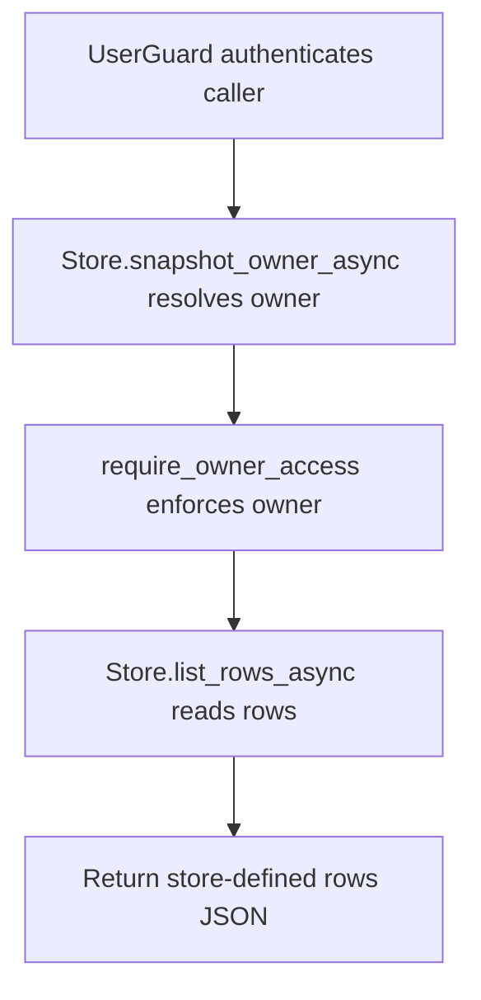

# GET /v1/history/structured/snapshots/{snapshot_id}/rows

## Summary
List rows attached to a structured snapshot.

## Handler
- Rust handler: `list_rows`
- Route registration: `src/routes.rs::build_router`
- Authentication: UserGuard; snapshot owner enforced

## Path Parameters
| Name | Type | Description |
| --- | --- | --- |
| snapshot_id | string | Structured snapshot identifier. |

## Query Parameters
None.

## JSON Body Parameters
No JSON body.

## Response
Schema: `JsonValue`

| Field | Type | Description |
| --- | --- | --- |
| ... | object or array | Endpoint-specific JSON returned by the store or debug helper. |

## Errors and Access Rules
- Malformed JSON or missing required runtime fields returns 400.
- Owner-scoped endpoints return 403 when the authenticated principal cannot access the requested owner.
- Store, Meilisearch, or LLM failures are returned through the shared ApiError JSON envelope.

## Internal Logic Call Graph

