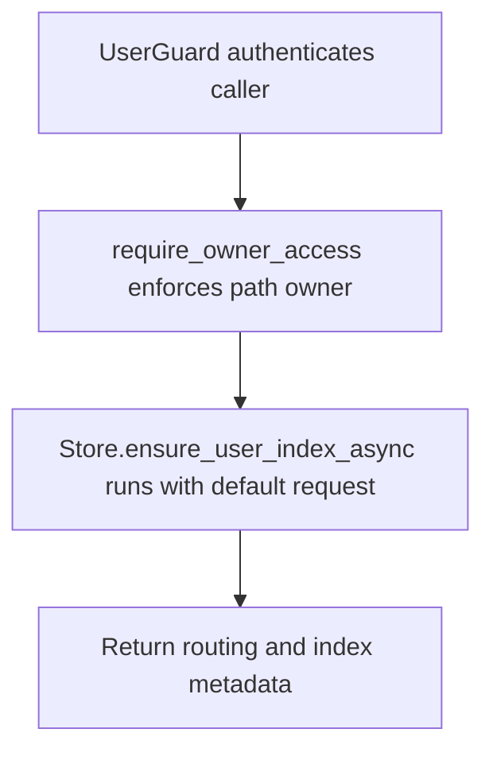

# GET /v1/history/users/{owner_user_id}/event-index

## Summary
Read or lazily ensure the event index routing for one owner.

## Handler
- Rust handler: `get_user_event_index`
- Route registration: `src/routes.rs::build_router`
- Authentication: UserGuard; path owner enforced

## Path Parameters
| Name | Type | Description |
| --- | --- | --- |
| owner_user_id | string | Owner user id whose private history index is targeted. |

## Query Parameters
None.

## JSON Body Parameters
No JSON body.

## Response
Schema: `UserEventIndexResponse`

| Field | Type | Description |
| --- | --- | --- |
| index | UserEventIndex | Persisted owner index metadata. |
| routing | EventIndexRouting | Resolved event and personal context index routing. |
| meili_task_uids | string[] | Settings/indexing tasks created in Meilisearch. |

## Errors and Access Rules
- Malformed JSON or missing required runtime fields returns 400.
- Owner-scoped endpoints return 403 when the authenticated principal cannot access the requested owner.
- Store, Meilisearch, or LLM failures are returned through the shared ApiError JSON envelope.

## Internal Logic Call Graph

