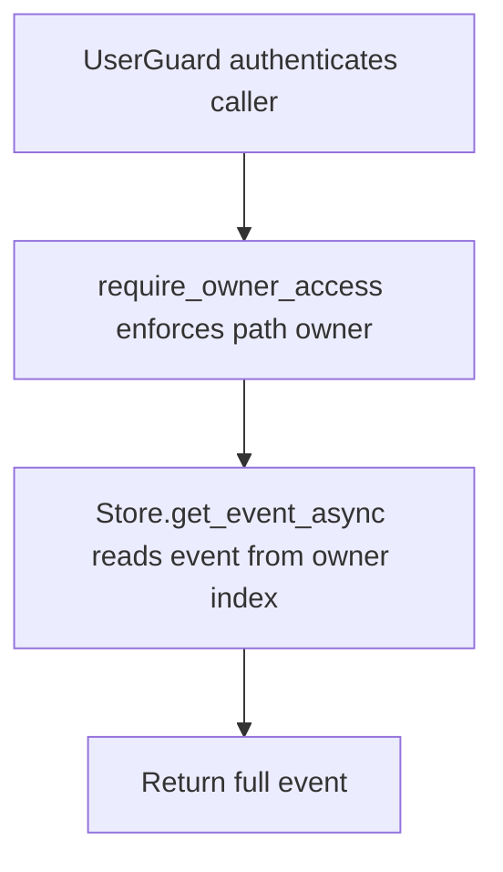

# GET /v1/history/users/{owner_user_id}/events/{event_id}

## Summary
Read one history event from a specific owner event index.

## Handler
- Rust handler: `get_user_event`
- Route registration: `src/routes.rs::build_router`
- Authentication: UserGuard; path owner enforced

## Path Parameters
| Name | Type | Description |
| --- | --- | --- |
| owner_user_id | string | Owner user id whose private history index is targeted. |
| event_id | string | History event identifier. |

## Query Parameters
None.

## JSON Body Parameters
No JSON body.

## Response
Schema: `HistoryEvent`

| Field | Type | Description |
| --- | --- | --- |
| ... | HistoryEvent | Full event record including owner, text, payload, routing, privacy, and timestamps. |

## Errors and Access Rules
- Malformed JSON or missing required runtime fields returns 400.
- Owner-scoped endpoints return 403 when the authenticated principal cannot access the requested owner.
- Store, Meilisearch, or LLM failures are returned through the shared ApiError JSON envelope.

## Internal Logic Call Graph

