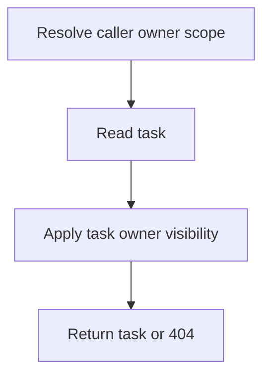

# GET /v1/ingest/tasks/{task_id}

Return current task metadata for an ingest task visible to the caller.

## Query

| Field | Type | Notes |
| --- | --- | --- |
| owner_user_id | string? | Defaults to authenticated owner. Admin without an owner can read all task scopes. |

## Response

`IngestTask`, including state, error, timestamps, source ids, status URL, result URL, and queue position metadata.

## Rules

- Private owner tasks are hidden from other owners.
- `failed` tasks retain the error string for polling/debugging.

