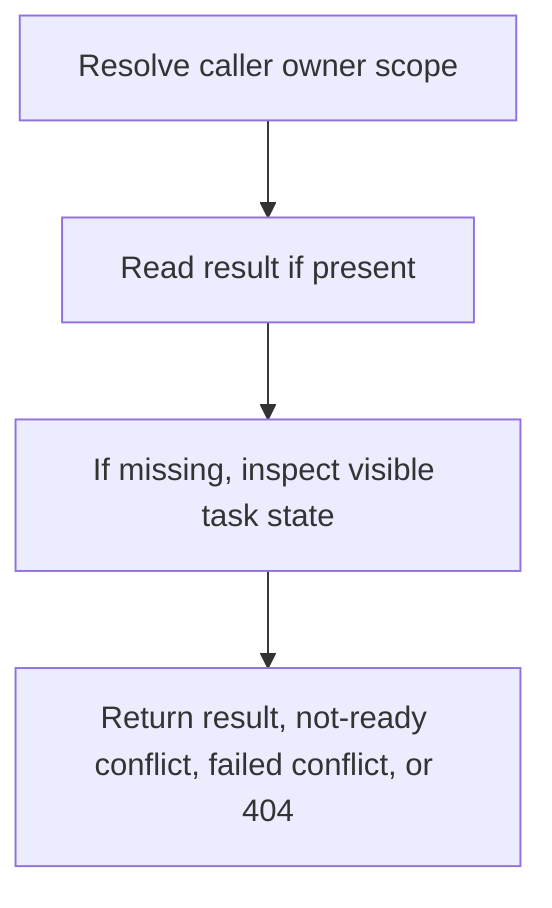

# GET /v1/ingest/tasks/{task_id}/result

Return the completed `IngestTaskResult` for a visible ingest task.

## Query

| Field | Type | Notes |
| --- | --- | --- |
| owner_user_id | string? | Defaults to authenticated owner. Admin without an owner can read all task scopes. |

## Responses

| Status | Meaning |
| --- | --- |
| 200 | Task completed; response is `IngestTaskResult`. |
| 409 | Task is still queued/in-progress, or failed and has no successful result. |
| 404 | Task/result is not visible or does not exist. |

## Rules

- Result ACL follows the task owner.
- Parse artifacts and source documents are returned as metadata only; source docs are not part of default retrieval.

