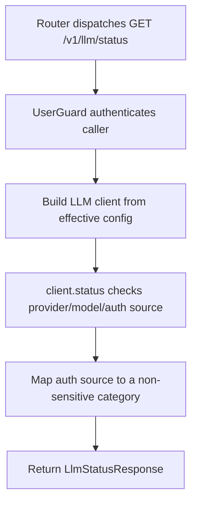

# GET /v1/llm/status

## Summary
Return authenticated, sanitized status for the configured LLM client.

## Handler
- Rust handler: `llm_status`
- Route registration: `src/routes.rs::build_router`
- Authentication: UserGuard

## Path Parameters
None.

## Query Parameters
None.

## JSON Body Parameters
No JSON body.

## Response
Schema: `LlmStatusResponse`

| Field | Type | Description |
| --- | --- | --- |
| provider | string | Configured provider. |
| model | string | Configured model. |
| auth_source | string | Non-sensitive credential-source category such as `codex_file`, `environment`, `mock`, or `none`; never a path or secret. |
| healthy | boolean | Client health result. |

## Errors and Access Rules
- Missing or invalid bearer authentication returns 401.
- Any authenticated owner, tenant-service, company-writer, or admin principal may read the sanitized status.
- Provider failures use the shared ApiError JSON envelope without exposing raw upstream response bodies or credential paths.

## Internal Logic Call Graph

