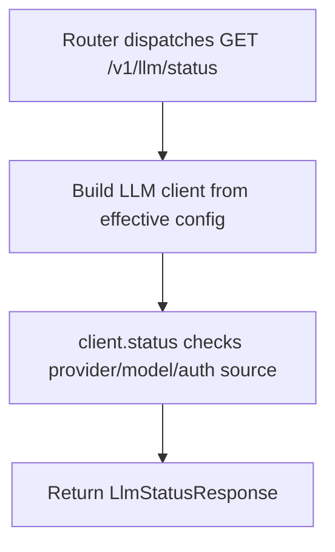

# GET /v1/llm/status

## Summary
Return status for the configured LLM client.

## Handler
- Rust handler: `llm_status`
- Route registration: `src/routes.rs::build_router`
- Authentication: None

## Path Parameters
None.

## Query Parameters
None.

## JSON Body Parameters
No JSON body.

## Response
Schema: `LlmStatusResponse`

| Field | Type | Description |
| --- | --- | --- |
| provider | string | Configured provider. |
| model | string | Configured model. |
| auth_source | string | Credential source. |
| healthy | boolean | Client health result. |

## Errors and Access Rules
- Malformed JSON or missing required runtime fields returns 400.
- Owner-scoped endpoints return 403 when the authenticated principal cannot access the requested owner.
- Store, Meilisearch, or LLM failures are returned through the shared ApiError JSON envelope.

## Internal Logic Call Graph

