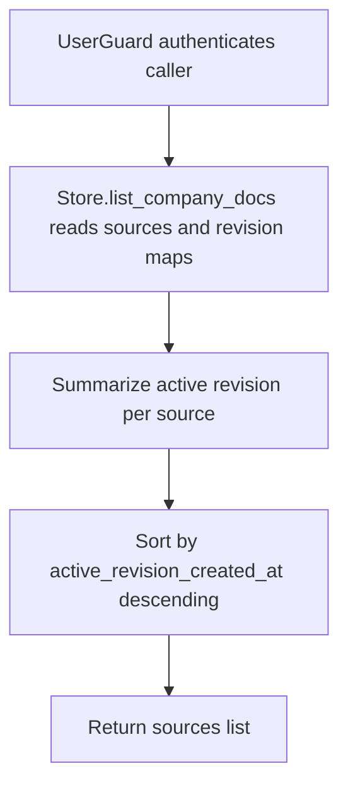

# GET /v1/state/company-docs

## Summary
List all company document sources with an active-revision summary and revision count per source.

## Handler
- Rust handler: `list_company_docs`
- Route registration: `src/routes.rs::build_router`
- Authentication: UserGuard

## Path Parameters
None.

## Query Parameters
None.

## JSON Body Parameters
No JSON body.

## Response
Schema: `JsonValue`

| Field | Type | Description |
| --- | --- | --- |
| sources | object[] | Source summaries sorted by `active_revision_created_at` descending; sources without an active revision sort last. |
| sources[].source_id | string | Company document source identifier. |
| sources[].title | string | Source title. |
| sources[].source_uri | string | Original document URI. |
| sources[].active_revision_id | string or null | Currently active revision id from the source pointer. |
| sources[].active_revision_created_at | string or null | Active revision creation timestamp. |
| sources[].active_revision_status | string or null | Active revision status. |
| sources[].revision_count | integer | Number of stored revisions for the source. |

## Errors and Access Rules
- Missing or invalid bearer authentication returns 401.
- Company documents are tenant-shared: authenticated owner, tenant-service, company-writer, and admin principals may list them.
- Store, Meilisearch, or LLM failures are returned through the shared ApiError JSON envelope.

## Internal Logic Call Graph

