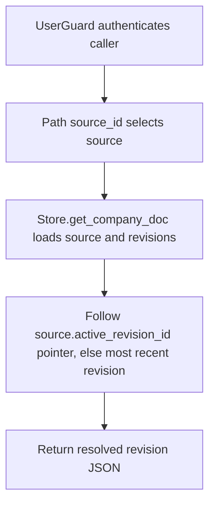

# GET /v1/state/company-docs/{source_id}

## Summary
Read a company document source resolved to its active revision content.

## Handler
- Rust handler: `get_company_doc`
- Route registration: `src/routes.rs::build_router`
- Authentication: UserGuard

## Path Parameters
| Name | Type | Description |
| --- | --- | --- |
| source_id | string | Company document source identifier. |

## Query Parameters
None.

## JSON Body Parameters
No JSON body.

## Response
Schema: `JsonValue`

| Field | Type | Description |
| --- | --- | --- |
| source_id | string | Company document source identifier. |
| title | string | Title of the resolved revision. |
| content | string | Content of the resolved revision. |
| revision_id | string | Id of the revision returned. |
| status | string | Stored status of the returned revision. Individual revisions can carry a stale `active` status; the source pointer is canonical. |
| created_at | string | Revision creation timestamp. |
| source_uri | string | Original document URI recorded on the revision. |
| active_revision_id | string or null | The source's canonical active-revision pointer. |

## Errors and Access Rules
- Missing or invalid bearer authentication returns 401.
- Company documents are tenant-shared: authenticated owner, tenant-service, company-writer, and admin principals may read them.
- Unknown `source_id` returns 404 (`source not found`); a source with zero stored revisions returns 404 (`no revisions for source`).
- Store, Meilisearch, or LLM failures are returned through the shared ApiError JSON envelope.

## Internal Logic Call Graph

