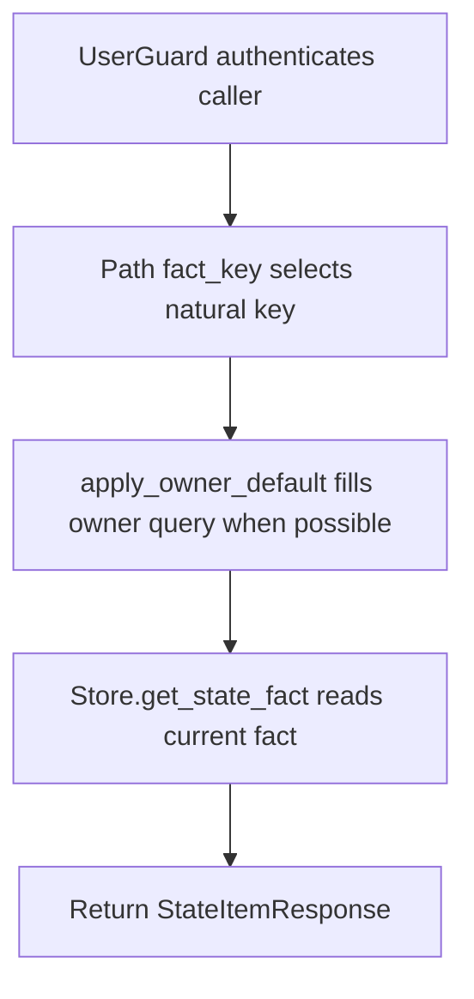

# GET /v1/state/profile/facts/{fact_key}

## Summary
Read one profile/state fact by natural key.

## Handler
- Rust handler: `get_state_fact`
- Route registration: `src/routes.rs::build_router`
- Authentication: UserGuard; owner default may apply

## Path Parameters
| Name | Type | Description |
| --- | --- | --- |
| fact_key | string | Natural key for a profile/state fact. |

## Query Parameters
| Name | Type | Requirement | Description |
| --- | --- | --- | --- |
| owner_user_id | string | optional | Owner scope. Owner-bound auth can supply a default; some alias reads require it explicitly. |

## JSON Body Parameters
No JSON body.

## Response
Schema: `StateItemResponse`

| Field | Type | Description |
| --- | --- | --- |
| item | StateItem | Current state fact. |
| history_event_id | string | History event emitted for the mutation. |
| context_uri | string | Context URI for the fact. |
| decision | string | Store merge/upsert decision. |

### StateItem Source References
Document-backed facts may include a `source_document` entry in `item.source_refs`. That entry points to the stored source document URI and may include generated fragment URIs in its metadata.

## Errors and Access Rules
- Malformed JSON or missing required runtime fields returns 400.
- Owner-scoped endpoints return 403 when the authenticated principal cannot access the requested owner.
- Store, Meilisearch, or LLM failures are returned through the shared ApiError JSON envelope.

## Internal Logic Call Graph

