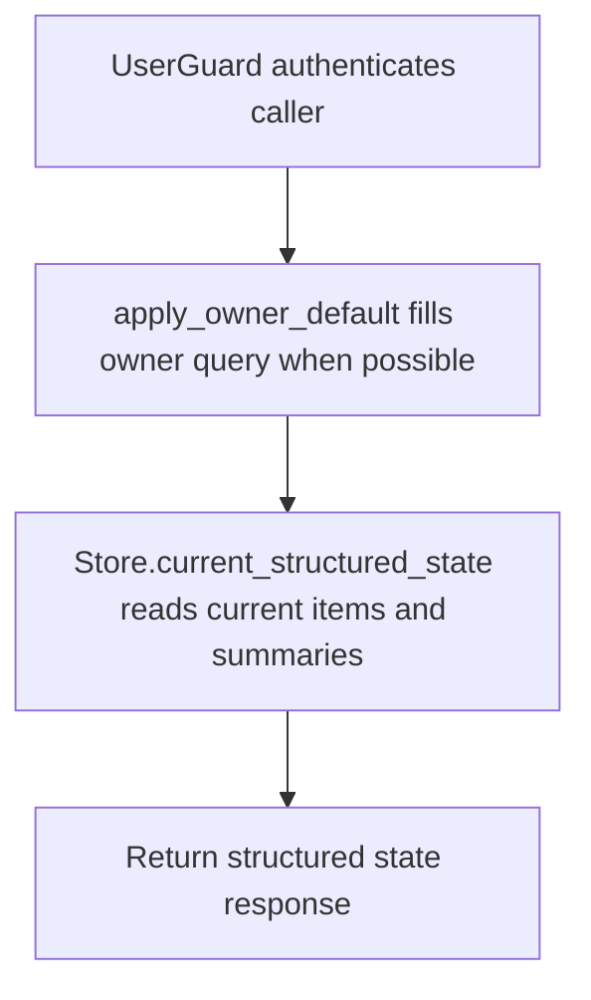

# GET /v1/state/structured/current

## Summary
Return current structured state items and summaries for an owner or admin-visible scope.

## Handler
- Rust handler: `current_structured`
- Route registration: `src/routes.rs::build_router`
- Authentication: UserGuard; owner default may apply

## Path Parameters
None.

## Query Parameters
| Name | Type | Requirement | Description |
| --- | --- | --- | --- |
| owner_user_id | string | optional | Owner scope. Owner-bound auth can supply a default; some alias reads require it explicitly. |

## JSON Body Parameters
No JSON body.

## Response
Schema: `CurrentStructuredStateResponse`

| Field | Type | Description |
| --- | --- | --- |
| items | StateItem[] | Current structured state items. |
| summaries | object[] | Structured summaries. |

## Errors and Access Rules
- Malformed JSON or missing required runtime fields returns 400.
- Owner-scoped endpoints return 403 when the authenticated principal cannot access the requested owner.
- Store, Meilisearch, or LLM failures are returned through the shared ApiError JSON envelope.

## Internal Logic Call Graph

