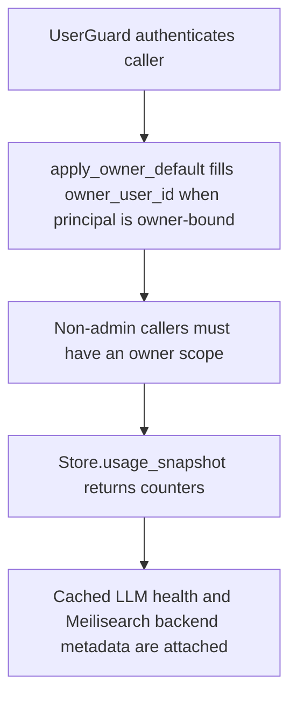

# GET /v1/usage

## Summary
Return usage counters and provider health for one owner or, for admins, optionally global usage.

## Handler
- Rust handler: `usage`
- Route registration: `src/routes.rs::build_router`
- Authentication: UserGuard; owner-bound for non-admin callers

## Path Parameters
None.

## Query Parameters
| Name | Type | Requirement | Description |
| --- | --- | --- | --- |
| owner_user_id | string | optional | Owner scope. Owner-bound auth can supply a default; some alias reads require it explicitly. |

## JSON Body Parameters
No JSON body.

## Response
Schema: `UsageResponse`

| Field | Type | Description |
| --- | --- | --- |
| generated_at | datetime | Snapshot generation time. |
| providers | object | Per-provider usage data plus meilisearch and llm health. |

## Errors and Access Rules
- Malformed JSON or missing required runtime fields returns 400.
- Owner-scoped endpoints return 403 when the authenticated principal cannot access the requested owner.
- Store, Meilisearch, or LLM failures are returned through the shared ApiError JSON envelope.

## Internal Logic Call Graph

