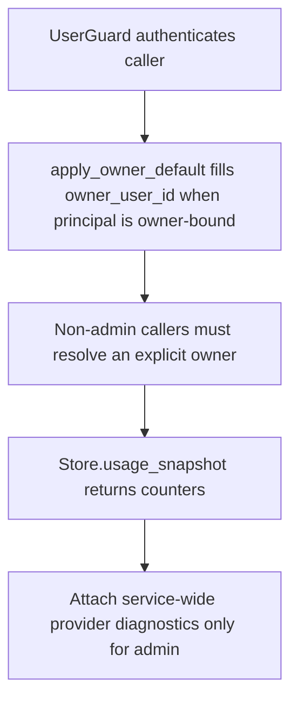

# GET /v1/usage

## Summary
Return counters for one owner or, for admins, global counters plus service-wide provider diagnostics.

## Handler
- Rust handler: `usage`
- Route registration: `src/routes.rs::build_router`
- Authentication: UserGuard; an explicit or owner-defaulted owner is required for non-admin callers

## Path Parameters
None.

## Query Parameters
| Name | Type | Requirement | Description |
| --- | --- | --- | --- |
| owner_user_id | string | optional | Owner scope. `Owner` auth supplies its bound default; `TenantService` must select an owner explicitly; only admin may omit it for global usage. |

## JSON Body Parameters
No JSON body.

## Response
Schema: `UsageResponse`

| Field | Type | Description |
| --- | --- | --- |
| generated_at | datetime | Snapshot generation time. |
| providers | object | Selected-owner usage counters. Admin responses may additionally include service-wide Meilisearch, parser, and LLM diagnostics. |

For `Owner` and `TenantService` principals, the response is limited to the
selected owner's counters; it does not expose service-wide backend state, LLM
budgets, plan data, credits, or credential-source information. Admin responses
may include the provider diagnostics documented for `/healthz`, including LLM
rate-limit windows.

### Selected-owner counter semantics

The provider object keeps the same counter keys for global and selected-owner
responses. Counters backed only by shared tenant state remain present but are
zero in a selected-owner response so their tenant-wide cardinality is not
disclosed.

| Counter | Selected-owner behavior |
| --- | --- |
| `contextfs.company_context_node_count` | Always `0`; company context is shared tenant state. |
| `contextfs.private_context_node_count` | Counts active personal context nodes for the selected owner. |
| `contextfs.context_node_count` | Equals `private_context_node_count`; shared company nodes are excluded. |
| `link_graph.link_count` | Counts links explicitly bound to the selected owner. Ownerless/shared links are excluded. |
| `structured_data.dataset_count` | Always `0`; dataset schemas are shared tenant state. |
| `structured_data.snapshot_count`, `row_count`, `summary_count`, `structured_state_item_count` | Count records attributable to the selected owner. |

An admin global response retains the tenant-wide company-context, ownerless
link, and dataset-schema counts.

## Errors and Access Rules
- Malformed JSON or missing required runtime fields returns 400.
- Owner-scoped endpoints return 403 when the authenticated principal cannot access the requested owner.
- `TenantService` can read usage for an explicitly selected owner but cannot request global usage.
- Only admin may request global counters or receive service-wide provider diagnostics.
- Store, Meilisearch, or LLM failures are returned through the shared ApiError JSON envelope.

## Internal Logic Call Graph

