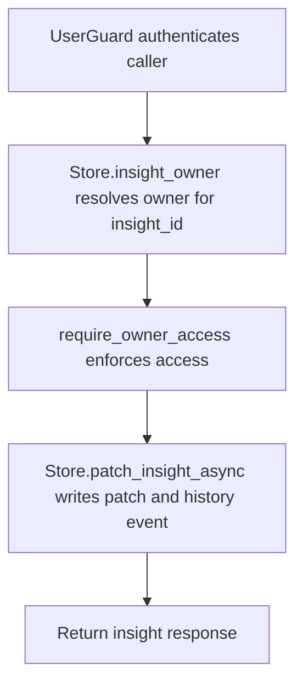

# PATCH /v1/state/insights/{insight_id}

## Summary
Patch an existing insight after resolving and authorizing its owner.

## Handler
- Rust handler: `patch_insight`
- Route registration: `src/routes.rs::build_router`
- Authentication: UserGuard; owner of existing insight is enforced

## Path Parameters
| Name | Type | Description |
| --- | --- | --- |
| insight_id | string | Insight identifier. |

## Query Parameters
None.

## JSON Body Parameters
Schema: `InsightPatchRequest`

| Field | Type | Requirement | Description |
| --- | --- | --- | --- |
| statement | string | optional | Replacement insight statement. |
| status | string | optional | Replacement status. |
| confidence | number | optional | Replacement confidence. |
| salience | number | optional | Replacement salience. |
| privacy | string | optional | Replacement privacy label. |
| valid_to | RFC3339 datetime | optional | Validity end time. |
| patch_reason | string | optional | Reason recorded with the patch event. |

## Response
Schema: `InsightResponse`

| Field | Type | Description |
| --- | --- | --- |
| insight | InsightRecord | Stored insight. |
| history_event_id | string | Mutation event id. |
| context_uri | string | Insight context URI. |

## Errors and Access Rules
- Malformed JSON or missing required runtime fields returns 400.
- Owner-scoped endpoints return 403 when the authenticated principal cannot access the requested owner.
- Store, Meilisearch, or LLM failures are returned through the shared ApiError JSON envelope.

## Internal Logic Call Graph

