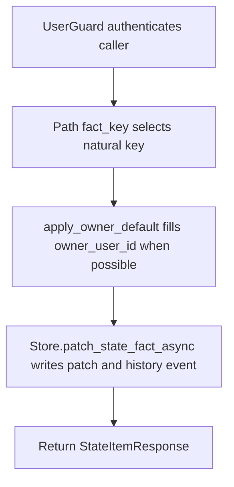

# PATCH /v1/state/profile/facts/{fact_key}

## Summary
Patch mutable fields on a profile/state fact.

Document payloads are accepted only by `PUT /v1/state/profile/facts/{fact_key}`. Patching updates the current fact fields; it does not replace source documents or regenerate fragments.

## Handler
- Rust handler: `patch_state_fact`
- Route registration: `src/routes.rs::build_router`
- Authentication: UserGuard; owner default may apply

## Path Parameters
| Name | Type | Description |
| --- | --- | --- |
| fact_key | string | Natural key for a profile/state fact. |

## Query Parameters
None.

## JSON Body Parameters
Schema: `PatchStateFactRequest`

| Field | Type | Requirement | Description |
| --- | --- | --- | --- |
| owner_user_id | string | optional, auth default may apply | Owner scope used for authorization and lookup. |
| statement | string | optional | Replacement statement. |
| value | JSON value | optional | Replacement structured value. |
| confidence | number | optional | Replacement confidence. |
| salience | number | optional | Replacement salience. |
| status | string | optional | Replacement status. |
| valid_to | RFC3339 datetime | optional | New validity end. |
| patch_reason | string | optional | Reason recorded with the history event. |

## Response
Schema: `StateItemResponse`

| Field | Type | Description |
| --- | --- | --- |
| item | StateItem | Current state fact. |
| history_event_id | string | History event emitted for the mutation. |
| context_uri | string | Context URI for the fact. |
| decision | string | Store merge/upsert decision. |

## Errors and Access Rules
- Malformed JSON or missing required runtime fields returns 400.
- Owner-scoped endpoints return 403 when the authenticated principal cannot access the requested owner.
- Tenant-service principals must provide `owner_user_id`; the service never
  selects the sole matching owner implicitly for a mutation.
- Store, Meilisearch, or LLM failures are returned through the shared ApiError JSON envelope.

## Internal Logic Call Graph

