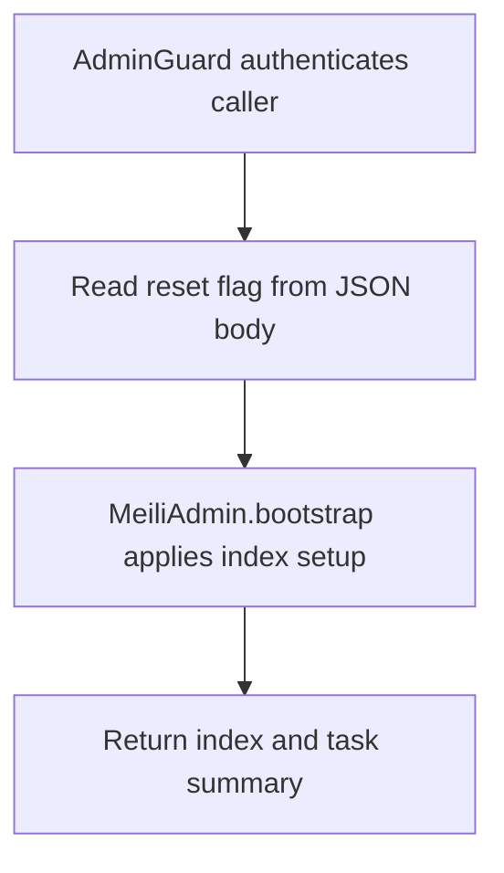

# POST /v1/admin/bootstrap

## Summary
Bootstrap or reset managed Meilisearch indexes and settings.

## Handler
- Rust handler: `bootstrap`
- Route registration: `src/routes.rs::build_router`
- Authentication: AdminGuard

## Path Parameters
None.

## Query Parameters
None.

## JSON Body Parameters
Schema: `BootstrapRequest`

| Field | Type | Requirement | Description |
| --- | --- | --- | --- |
| reset | boolean | optional, default false | When true, asks the Meilisearch bootstrapper to reset managed indexes before applying settings. |

## Response
Schema: `BootstrapResponse`

| Field | Type | Description |
| --- | --- | --- |
| indexes | array | Managed index bootstrap results. |
| tasks | array | Meilisearch task identifiers or task details. |
| dry_run | boolean | Whether bootstrap ran without mutating indexes. |

## Errors and Access Rules
- Malformed JSON or missing required runtime fields returns 400.
- Owner-scoped endpoints return 403 when the authenticated principal cannot access the requested owner.
- Store, Meilisearch, or LLM failures are returned through the shared ApiError JSON envelope.

## Internal Logic Call Graph

