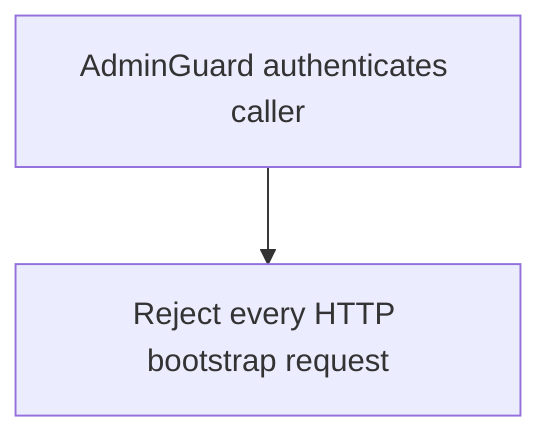

# POST /v1/admin/bootstrap

## Summary
This legacy mutation endpoint is disabled. Service startup reconciles and waits
for all managed Meilisearch settings before tenant hydration and before binding
the HTTP listener.

Managed indexes include `rag_source_documents`, which stores full raw source documents outside default context/RAG retrieval.

## Handler
- Rust handler: `bootstrap`
- Route registration: `src/routes.rs::build_router`
- Authentication: AdminGuard

## Path Parameters
None.

## Query Parameters
None.

## JSON Body Parameters
Schema: `BootstrapRequest`

| Field | Type | Requirement | Description |
| --- | --- | --- | --- |
| reset | boolean | optional | Ignored. All HTTP bootstrap requests are rejected because fixed indexes may be shared by multiple tenants. |

## Response
No success response is available over HTTP. Controlled startup and maintenance
tooling own managed-index reconciliation.

### Managed RAG Index Notes
- Context indexes include filterable attributes for `node_kind`, `retrieval_role`, `retrieval_enabled`, `parent_uri`, `source_document_uri`, and `fragment_index`.
- `rag_source_documents` stores full source document content with `retrieval_enabled=false` by default.
- `rag_links` keeps `part_of` links from fragments to source documents.

## Errors and Access Rules
- Malformed JSON or missing required runtime fields returns 400.
- Every request returns 400. Tenant-local HTTP administrators cannot mutate settings for shared fixed indexes.
- Owner-scoped endpoints return 403 when the authenticated principal cannot access the requested owner.
- Store, Meilisearch, or LLM failures are returned through the shared ApiError JSON envelope.

## Internal Logic Call Graph

