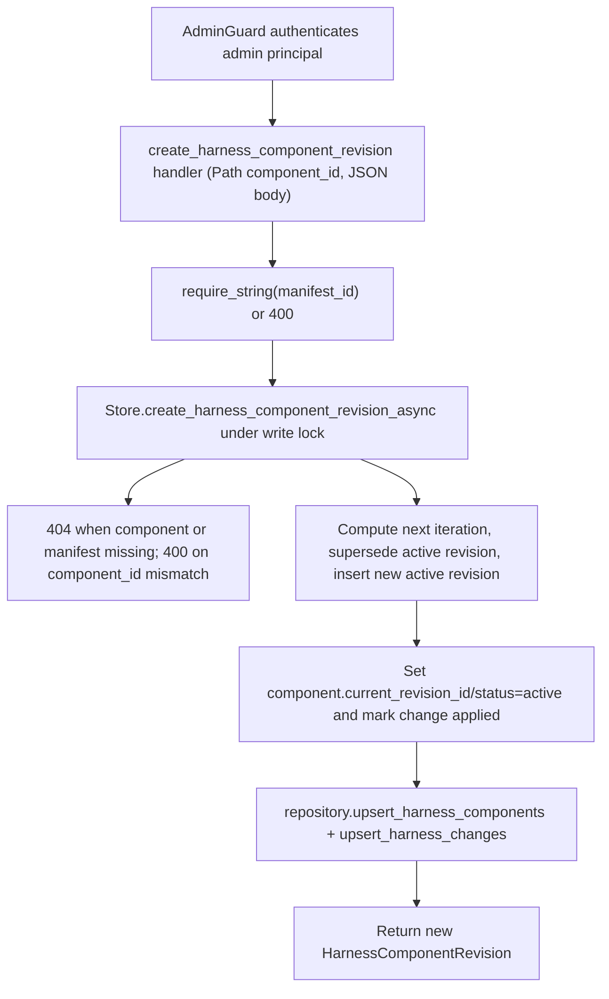

# POST /v1/admin/harness/components/{component_id}/revisions

## Summary
Create a new revision for a harness component from a change manifest. The revision iteration is auto-incremented, any previously `active` revision is marked `superseded`, the new revision becomes the component's `current_revision_id`, and the referencing change manifest is moved to `applied`.

## Handler
- Rust handler: `create_harness_component_revision`
- Route registration: `src/routes.rs::build_router`
- Authentication: AdminGuard

## Path Parameters
| Name | Type | Description |
| --- | --- | --- |
| component_id | string | Harness component the revision belongs to. |

## Query Parameters
None.

## JSON Body Parameters
Schema: `CreateHarnessComponentRevisionRequest`

| Field | Type | Requirement | Description |
| --- | --- | --- | --- |
| manifest_id | string | Required | Harness change manifest id the revision applies. Returns 400 when missing or empty. |
| files | string[] | Optional | Files for the revision; falls back to the manifest's `files` when the array is empty. Defaults to `[]`. |
| content | any (JSON) | Optional | Arbitrary revision payload; defaults to `null`. |
| created_by | string | Optional | Author label; defaults to `admin`. |

## Response
Schema: `HarnessComponentRevision`

| Field | Type | Description |
| --- | --- | --- |
| id | string | Revision identifier (`hrev` prefix). |
| tenant_id | string | Owning tenant id. |
| component_id | string | Parent component id. |
| iteration | integer (u32) | Assigned iteration = current max iteration + 1 (first revision is 1). |
| manifest_id | string | Change manifest that produced this revision. |
| files | string[] | Files carried by the revision (request `files`, or the manifest's `files` when omitted). |
| content | any (JSON) | Revision payload echoed from the request; `null` when omitted. |
| status | string | Always `active` for the newly created revision. |
| created_by | string | Author; the request value or `admin`. |
| created_at | string (RFC3339) | Creation timestamp. |

## Errors and Access Rules
- Malformed JSON or missing required runtime fields returns 400.
- Owner-scoped endpoints return 403 when the authenticated principal cannot access the requested owner.
- Store, Meilisearch, or LLM failures are returned through the shared ApiError JSON envelope.
- Missing or empty `manifest_id` returns 400 (`manifest_id is required`).
- Unknown `component_id` returns 404 (`harness component not found`).
- Unknown `manifest_id` returns 404 (`harness change manifest not found`).
- A manifest whose `component_id` does not match the path `component_id` returns 400 (`manifest component_id does not match revision component_id`).
- Admin-only: requires a valid admin principal via `AdminGuard`; non-admin principals return 403 (`admin token required`) and missing or invalid bearer tokens return 401.

## Internal Logic Call Graph

