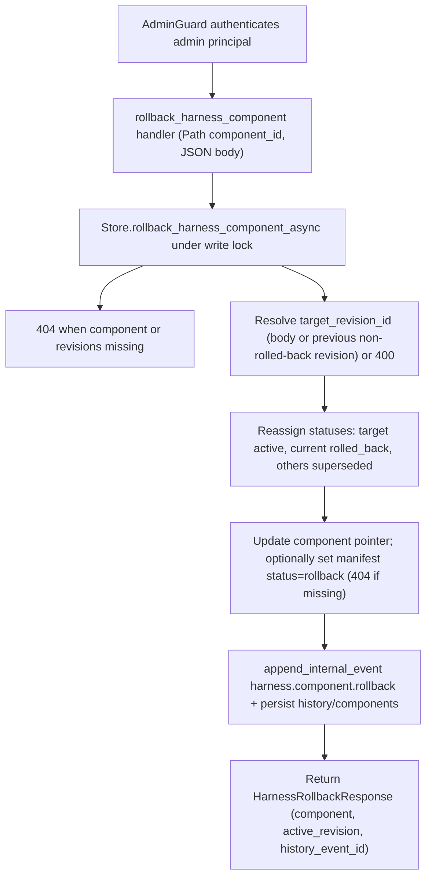

# POST /v1/admin/harness/components/{component_id}/rollback

## Summary
Roll a harness component back to a prior revision. The target revision becomes `active`, the previously current revision is marked `rolled_back`, any other `active` revision is `superseded`, and the component pointer is updated. A `harness.component.rollback` history event is appended under the company scope, and an optionally supplied change manifest is moved to `rollback`.

## Handler
- Rust handler: `rollback_harness_component`
- Route registration: `src/routes.rs::build_router`
- Authentication: AdminGuard

## Path Parameters
| Name | Type | Description |
| --- | --- | --- |
| component_id | string | Harness component to roll back. |

## Query Parameters
None.

## JSON Body Parameters
Schema: `RollbackHarnessComponentRequest` (all fields optional; an empty object `{}` is accepted)

| Field | Type | Requirement | Description |
| --- | --- | --- | --- |
| target_revision_id | string | Optional | Revision to roll back to. When omitted, defaults to the highest-iteration revision that is neither the current revision nor already `rolled_back`. Returns 400 when no target can be resolved. |
| manifest_id | string | Optional | When set, the referenced change manifest's status is set to `rollback`. Returns 404 when the manifest does not exist. |
| reason | string | Optional | Message stored on the emitted history event; a default message is generated when omitted. |
| created_by | string | Optional | Author label; defaults to `admin`. |

## Response
Schema: `HarnessRollbackResponse`

| Field | Type | Description |
| --- | --- | --- |
| component | HarnessComponent | Updated component with `current_revision_id` pointing at the target revision and `status` = `active` (fields below). |
| active_revision | HarnessComponentRevision | The now-active target revision (fields below). |
| history_event_id | string | Id of the appended `harness.component.rollback` history event. |

`HarnessComponent` fields:

| Field | Type | Description |
| --- | --- | --- |
| id | string | Component identifier. |
| tenant_id | string | Owning tenant id. |
| display_name | string | Human-readable component name. |
| component_kind | string | Component category/kind label. |
| description | string | Free-text description. |
| status | string | Lifecycle status; `active` after rollback. |
| current_revision_id | string or null | Active revision id; omitted when unset. |
| created_at | string (RFC3339) | Creation timestamp. |
| updated_at | string (RFC3339) | Refreshed on rollback. |

`HarnessComponentRevision` fields:

| Field | Type | Description |
| --- | --- | --- |
| id | string | Revision identifier (`hrev` prefix). |
| tenant_id | string | Owning tenant id. |
| component_id | string | Parent component id. |
| iteration | integer (u32) | Revision number. |
| manifest_id | string | Change manifest that produced the revision. |
| files | string[] | Files carried by the revision. |
| content | any (JSON) | Arbitrary revision payload. |
| status | string | `active` for the rolled-back-to revision. |
| created_by | string | Author. |
| created_at | string (RFC3339) | Creation timestamp. |

## Errors and Access Rules
- Malformed JSON or missing required runtime fields returns 400.
- Owner-scoped endpoints return 403 when the authenticated principal cannot access the requested owner.
- Store, Meilisearch, or LLM failures are returned through the shared ApiError JSON envelope.
- Unknown `component_id` returns 404 (`harness component not found`).
- A component with no recorded revisions returns 404 (`harness revisions not found`).
- No resolvable target (no `target_revision_id` and no eligible previous revision) returns 400 (`target_revision_id is required`).
- A `target_revision_id` that does not exist for the component returns 404 (`target harness revision not found`).
- A supplied `manifest_id` that does not exist returns 404 (`harness change manifest not found`).
- Admin-only: requires a valid admin principal via `AdminGuard`; non-admin principals return 403 (`admin token required`) and missing or invalid bearer tokens return 401.

## Internal Logic Call Graph

