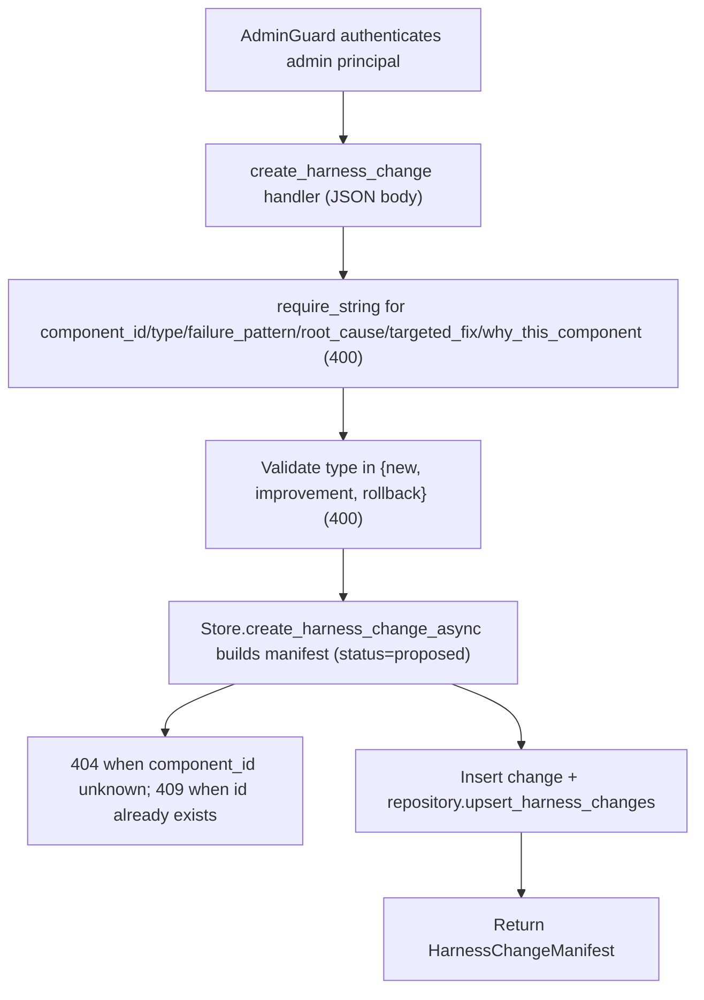

# POST /v1/admin/harness/evolution/changes

## Summary
Create a harness change manifest describing a proposed component change. The manifest is validated, assigned `status` `proposed`, stored, and mirrored to the repository. The target component must already exist and the change id must be unique.

## Handler
- Rust handler: `create_harness_change`
- Route registration: `src/routes.rs::build_router`
- Authentication: AdminGuard

## Path Parameters
None.

## Query Parameters
None.

## JSON Body Parameters
Schema: `CreateHarnessChangeManifestRequest`

| Field | Type | Requirement | Description |
| --- | --- | --- | --- |
| id | string | Optional | Change id; a new `hchange` id is minted when omitted. Reusing an existing id returns 409. |
| iteration | integer (u32) | Optional | Iteration number; defaults to 1. |
| type | string | Required | Change type; must be one of `new`, `improvement`, `rollback`. Serialized field name is `type`. Returns 400 when missing or invalid. |
| component_id | string | Required | Target component; must reference an existing component. Returns 400 when missing, 404 when unknown. |
| files | string[] | Optional | Files touched; defaults to `[]`. |
| failure_pattern | string | Required | Observed failure pattern. Returns 400 when missing or empty. |
| root_cause | string | Required | Diagnosed root cause. Returns 400 when missing or empty. |
| targeted_fix | string | Required | Targeted fix description. Returns 400 when missing or empty. |
| predicted_fixes | string[] | Optional | Predicted fixes; defaults to `[]`. |
| risk_cases | string[] | Optional | Risk cases; defaults to `[]`. |
| expected_metric_deltas | any (JSON) | Optional | Expected metric deltas; defaults to `null`. |
| baseline_eval_run_id | string | Optional | Baseline eval run id. |
| candidate_eval_run_id | string | Optional | Candidate eval run id. |
| why_this_component | string | Required | Rationale for targeting this component. Returns 400 when missing or empty. |
| created_by | string | Optional | Author label; defaults to `admin`. |

## Response
Schema: `HarnessChangeManifest`

| Field | Type | Description |
| --- | --- | --- |
| id | string | Change identifier (request `id` or a new `hchange` id). |
| tenant_id | string | Owning tenant id. |
| iteration | integer (u32) | Iteration number; `1` when omitted. |
| type | string | Validated change type (serialized field name is `type`). |
| component_id | string | Target component id. |
| files | string[] | Files touched by the change. |
| failure_pattern | string | Observed failure pattern. |
| root_cause | string | Diagnosed root cause. |
| targeted_fix | string | Targeted fix description. |
| predicted_fixes | string[] | Predicted fixes. |
| risk_cases | string[] | Risk cases. |
| expected_metric_deltas | any (JSON) | Expected metric deltas; `null` when omitted. |
| baseline_eval_run_id | string or null | Baseline eval run id; omitted when unset. |
| candidate_eval_run_id | string or null | Candidate eval run id; omitted when unset. |
| why_this_component | string | Rationale for targeting this component. |
| created_by | string | Author; the request value or `admin`. |
| created_at | string (RFC3339) | Creation timestamp. |
| status | string | Always `proposed` on creation. |

## Errors and Access Rules
- Malformed JSON or missing required runtime fields returns 400.
- Owner-scoped endpoints return 403 when the authenticated principal cannot access the requested owner.
- Store, Meilisearch, or LLM failures are returned through the shared ApiError JSON envelope.
- Missing `component_id`, `type`, `failure_pattern`, `root_cause`, `targeted_fix`, or `why_this_component` returns 400 (`<field> is required`).
- A `type` outside `new`, `improvement`, `rollback` returns 400 (`type must be one of new, improvement, rollback`).
- An unknown `component_id` returns 404 (`harness component not found`).
- A duplicate change `id` returns 409 (`harness change already exists`).
- Admin-only: requires a valid admin principal via `AdminGuard`; non-admin principals return 403 (`admin token required`) and missing or invalid bearer tokens return 401.

## Internal Logic Call Graph

