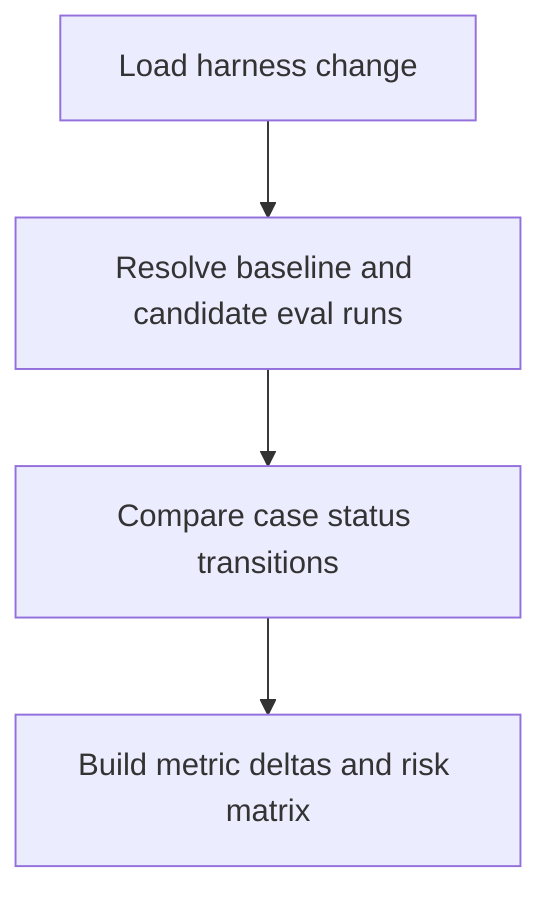

# POST /v1/admin/harness/evolution/changes/{change_id}/compare

Compute a before/after eval delta for a harness change.

## Request

```json
{
  "baseline_eval_run_id": "evalrun_baseline",
  "candidate_eval_run_id": "evalrun_candidate"
}
```

Both fields are optional when the change manifest already stores run ids.

## Response

`EvalDeltaReport` with fixed cases, regressed cases, unchanged pass/fail cases, metric deltas, and a risk matrix.

## Rules

- Admin-only.
- Verdicts use this delta evidence when baseline and candidate runs are available.


